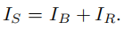

# deblurGAN 论文阅读总结和讨论

look for [papers for deblurGAN](./ECCV2018_deblurGAN.pdf)
contributer : [leoluopy](https://github.com/leoluopy)

+ 欢迎提issue.欢迎watch ，star.
+ 微信号：leoluopy
+ 关注AI前沿技术及商业落地，欢迎交流

# Overview
+ 端到端的条件GAN修复网络
+ 在PSNR和SSIM参数对比情况下比同期deepblur快5倍
+ 提出新颖的模糊方法和新的使用检测网络评价优劣的手段

> a method generating synthetic motion blurred image GANs preserve texture details , create image manifold and look perceptually convincing

>  loss design and new architecture 5x faster than deep blur(the fastest before 2018)

## 性能对比

> PSNR 用于评价画面质量，品质指数

> SSIM 用于评价图像结构相似性指数

> 速率方面，由于舍弃了大量的残差堆叠过程，速率指数级别提升。

## 结构综述

+ 整体模型结构12921.
+ 1个普通卷积模块，2个1/2卷积模块，9个残差模块，2个反卷积模块，1个带tanh卷积模块。
+ 输入图像跳跃至输出加 所有层输出的运算矢量，得图像修复结果
>  

    + IS 修复的图像
    + IR 通过12921运算得到的修复图像矢量
    + IB 输入的模糊图像
+ 残差模块每个模块由卷积，instanceNore和Relu构成
+ 其他卷积模块使用instanceNorm和LeakyRelu（a=0.2），最后一层卷积例外
+ dropOut 和 instanceNorm 在推理阶段仍然使用

## GAN 提要

> 先讲GAN的必要性？

+ 

## loss 方法

## Training 方法

## 在目标检测中的贡献

 

