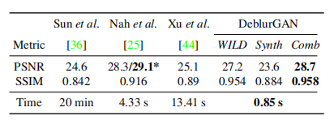

# CRNN 论文阅读总结和讨论

look for [papers for crnn](./pami2015_crnn.pdf)
contributer : [leoluopy](https://github.com/leoluopy)

+ 欢迎提issue.欢迎watch ，star.
+ 微信号：leoluopy
+ 关注AI前沿技术及商业落地，欢迎交流

# Overview
+ 
> 
## 性能对比

## 结构综述

+ 

## GAN 提要

> 先讲GAN的必要性？

+ 

## loss 方法

## Training 方法

## 在目标检测中的贡献

 

