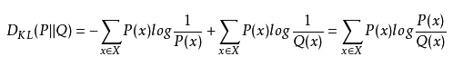
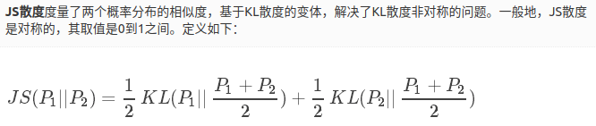

# deblurGAN 论文阅读总结和讨论

look for [papers for deblurGAN](./ECCV2018_deblurGAN.pdf)
contributer : [leoluopy](https://github.com/leoluopy)

+ 欢迎提issue.欢迎watch ，star.
+ 微信号：leoluopy
+ 关注AI前沿技术及商业落地，欢迎交流

# Overview
+ 端到端的条件GAN修复网络,首个以不适定问题思路解决图像模糊修复问题
+ 在PSNR和SSIM参数对比情况下比同期deepblur快5倍
+ 提出新颖的模糊方法和新的使用检测网络评价优劣的手段

> a method generating synthetic motion blurred image GANs preserve texture details , create image manifold and look perceptually convincing

>  loss design and new architecture 5x faster than deep blur(the fastest before 2018)

## 性能对比

> PSNR 用于评价画面质量，品质指数

> SSIM 用于评价图像结构相似性指数

> 速率方面，由于舍弃了大量的残差堆叠过程，速率指数级别提升。

## 结构综述

+ 整体模型结构12921.
+ 1个普通卷积模块，2个1/2卷积模块，9个残差模块，2个反卷积模块，1个带tanh卷积模块。
+ 输入图像跳跃至输出加 所有层输出的运算矢量，得图像修复结果
>  

    + IS 修复的图像
    + IR 通过12921运算得到的修复图像矢量
    + IB 输入的模糊图像
+ 残差模块每个模块由卷积，instanceNore和Relu构成
+ 其他卷积模块使用instanceNorm和LeakyRelu（a=0.2），最后一层卷积例外
+ dropOut 和 instanceNorm 在推理阶段仍然使用

## GAN 提要

> x 为输入图像，　Ｄ为判别器，Ｇ为生成器，　Ｐｒ图像分布，Ｐｇ为模型分布。

> 原始GAN网络的loss设计，具有训练生成器或判别器不容易，并且不能对单独一方训练太好，导致梯度消失无法训练问题，同时原始ＧＡＮ也容易导致模式奔溃，导致生成的目标缺乏多样性。

> GAN网络难以训练的理解：
  +  
  + 
  + 上图公式图KL散度和JS散度，详细说明见参考文献。经过大神得到推导，GAN网络最终的优化目标实际上是求两个概率分布JS散度的最优值，
  而当这两个概率分布完全不一致的时候，JS散度为常数，那么对应的梯度为0,在深度学习的框架实现中这一情况下，梯度也就几乎消失了。因此难以训练。

> ＷＧＡＮ作者通过多篇的数学推导和数学论证，证明和说明了ＧＡＮ网络之所以难以训练的原因并给出了解决方案，Wasserstein距离，如上图所示。
> Wasserstein距离相对于JS和KL散度，具备导数不突变，连续的特点，更加利于梯度平滑求导，利于深度学习训练。
> WGAN 的改进如下：

    + 判别器最后一层去掉sigmoid
    + 生成器和判别器的loss不取log
    + 每次更新判别器的参数之后把它们的绝对值截断到不超过一个固定常数c
    + 不要用基于动量的优化算法（包括momentum和Adam），推荐RMSProp，SGD也行
> TIPS: 有没有发现这些修改基本都有一个目的，曲线由以前的陡峭变得更加平滑，由以前不设置梯度限制，到设置梯度限制，
都能达到生成器能跟随判别器进行数据学习，梯度下降的目的。

> **关于更新参数截取使用的lipschitz常数理解**

> 假如不进行Lipschitz常数的限制，
 那么D会倾向于给fake sample打低分，给real sample打高分，而两者之间的D(X)会倾向于产生一个gap，这样对于与真实分布 
 与G映射出来的分布之间就形成不了有效的梯度，即G会不知道如何让fake sample改变来获得高分.
 加上Lipschitz限制条件之后，在D使得上面的损失函数最大化的时候，因为梯度不能太大，
 D不能无脑的并且无限制的给fake打低分，给real打给分，因为这样会使得fake与real只之间的Lipschitz大于k，
 也就是加上此限制后，D(X)并不会在fake分布的区域打很低的分数，然后经历一个gap到real分布的很高的参数，
 而是在fake与real之间形成一个较为平缓的坡，fake处G可以了解到往哪里移动过可以获得更高的分数，从而解决对G来说梯度消失的问题。
 实现的时候想到了一个方法就是简单将参数clip，简单的限制到一个区间中，这样经过简单的乘加，Lipschitz必定是限制在某个上限下
    

> 基于以上的描述WGAN最终的Loss定义如上图两项所示。
 

## loss 方法

+ deblurGAN的loss函数由两部分组成,WGAN-loss和content-loss
+ WGAN-loss控制图像生成的真假判别性
+ content-loss控制生成图像的特征质量

＋　WGAN－loss 在deblurGAN 中的表示形式

> content-loss 详细表达形式，

    + WH:特征图长宽
    + IB:模糊图像, IS 清晰图像
    + xy:特征图具体位置
    + Φ: 提取当前特征图位置特征

## Training 方法

> deblurGAN 输入原始模糊图像，通过生成器生成恢复后图像，恢复图像与原始ＧＴ做**content-loss** 和　**WGAN-loss** 优化

+ 参考的合成图像以及由高速相机造成的模糊图像比例设置２：１
+ 判别器训练５步，生成器训练１步，交替训练
+ 使用Adam优化器训练,首个150epoch :学习率10^-4,随后150epoch学习率线性降低至０
+ dropOut 和 instanceNorm 在推理阶段仍然使用
+ batch size 设置为1, 在GoPro 数据集大约训练需要6天

## 在目标检测中的贡献

> deblurGAN 对模糊图像的恢复能有效提高检测网络对目标检测的置信度

> 有效提高Recall 从而提高 F1

## 参考文章：

+ ＷＧＡＮ：　https://www.cnblogs.com/Allen-rg/p/10305125.html
+ ＷＧＡＮ－ＧＰ　：　https://blog.csdn.net/weixin_41036461/article/details/82385334
+ 理解　ＷＧＡＮ好训练：https://blog.csdn.net/xiaoxifei/article/details/86611566
+ KL,JS 散度，wassertein 距离：　https://zxth93.github.io/2017/09/27/KL%E6%95%A3%E5%BA%A6JS%E6%95%A3%E5%BA%A6Wasserstein%E8%B7%9D%E7%A6%BB/index.html
+ JS 散度：https://www.cnblogs.com/smuxiaolei/p/7400923.html
+ 论文译文：　https://blog.csdn.net/a312863063/article/details/86627030
+ 论文笔记１：　https://blog.csdn.net/yh0vlde8vg8ep9vge/article/details/78641844
+ 论文笔记２：https://zhuanlan.zhihu.com/p/32260634

