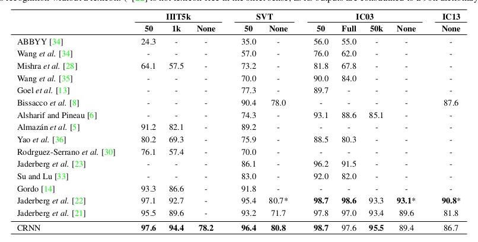
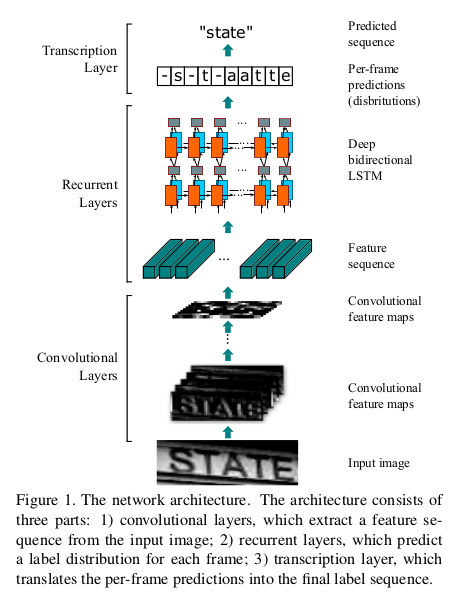
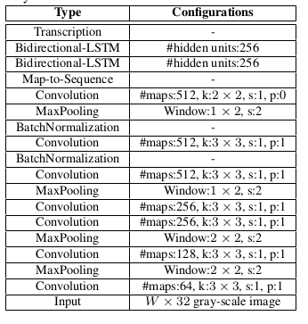
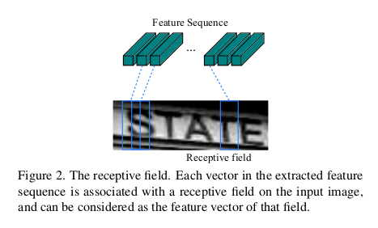
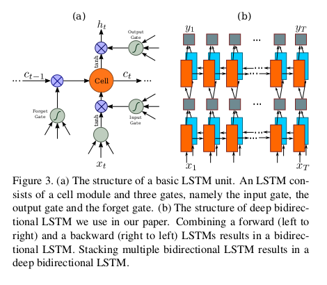
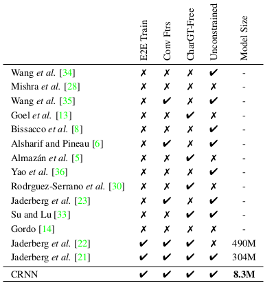

# CRNN 论文阅读总结和讨论

look for [papers for crnn](./pami2015_crnn.pdf)
contributer : [leoluopy](https://github.com/leoluopy)

+ 欢迎提issue.欢迎watch ，star.
+ 微信号：leoluopy
+ 关注AI前沿技术及商业落地，欢迎交流


# Overview
+ 端到端的训练，不需要分模块训练 【无需，手工提取的特征，比如HOG特征，或者图像前处理。】
+ 随意的长度,标注不需要对齐.  【流行的 DCNN 是固定长度的】，。
+ 不需要预定义字典，在固定字典和非固定字典场景表现良好
+ 模型小,权重共享，没有全连接层
> 权重共享是CNN的特性

> 全连接层是主要的权重参数来源这里没有全连接层，减少大量参数。

> 在之前也有很多方法：例如单独字符定位然后用分类器来分类。也有使用RNN来记忆前后信息关联性识别字符。
但RNN 不能 End2end training，基本需要手工提取特征例如HUG特征等。
还有通过CNN提取特征，映射相应特征到字典，这将问题转换为检索问题。
## 性能对比

> 50 ， 1k ，50k ，Full 代表使用的字典中单词数目， None表示不使用字典。

> 符号 - 表示网络模型不支持，或者没有报告结果
## 结构综述 【pipeline 总体流程】
+ 
> 整体网络由三部分组成，第一部分卷积网络提取图像特征，第二部分是RNN双向lstm使用提取的特征来计算字符序列。
第三部分转换层，对字符串序列进行精加工计算最后的输出识别结果（也是字符串）
+  
> maps: filter数目，k：卷积核长宽，s：步长stride，p：padding像素数


### CNN 特征提取
+ 
+ Scale 高度固定32，长度可变，可适应不同长度字符串图片
+ 改进网络，第3层池化，和第4层池化采用了1x2维度，用以获得更长的特征，在比较窄的字符上能有更强的表达力（比如 i l 这样的字符）
+ 参考代码：高度scale到32，宽度对应进行scale，最后进行相应数据空间变换：
```angular2html
    def __call__(self, img):
        size = self.size
        imgW, imgH = size
        scale = img.size[1] * 1.0 / imgH
        w = img.size[0] / scale
        w = int(w)
        img = img.resize((w, imgH), self.interpolation)
        w, h = img.size
        if w <= imgW:
            newImage = np.zeros((imgH, imgW), dtype='uint8')
            newImage[:] = 255
            newImage[:, :w] = np.array(img)
            img = Image.fromarray(newImage)
        else:
            img = img.resize((imgW, imgH), self.interpolation)
            # img = (np.array(img)/255.0-0.5)/0.5
        img = transforms.ToTensor()(img)
        img.sub_(0.5).div_(0.5)
        return img
```
### RNN 结构
+ 
+ RNN 获取特征上下文信息， 稳定，信息更丰富，因此同时具备模糊图像兼容能力。
+ 反向传递梯度给CNN网络，使得端到端的训练成为可能
+ RNN 接受可变长输入特征，使得本网络支持可变长的字符识别。
+ 传统rnn 有梯度消失问题，无法记录较长序列，lstm专门为此设计。
+ 双向lstm 使用节点前和节点后数据，效果提升
+ lstm 参考代码：
```angular2html

class BidirectionalLSTM(nn.Module):

    def __init__(self, nIn, nHidden, nOut):
        '''
            pytorch 实现的 LSTM
        :param nIn: 输入特征
        :param nHidden: 隐藏单元
        :param nOut: 输出序列
        '''
        super(BidirectionalLSTM, self).__init__()

        self.rnn = nn.LSTM(nIn, nHidden, bidirectional=True)
        self.embedding = nn.Linear(nHidden * 2, nOut)

    def forward(self, input):
        recurrent, _ = self.rnn(input)
        ''' rnn 返回
        Outputs: output, (h_n, c_n)
        output of shape (seq_len, batch, num_directions * hidden_size)
        h_n of shape (num_layers * num_directions, batch, hidden_size)
        c_n (num_layers * num_directions, batch, hidden_size) 
        '''
        T, b, h = recurrent.size()
        t_rec = recurrent.view(T * b, h)

        output = self.embedding(t_rec)  # [T * b, nOut]
        output = output.view(T, b, -1)

        return output
```
> view 是pytorch中常用的变换维度函数，使用方便。
### Transcription 层（转换层）

+ 概率预测采用 [ctc](https://distill.pub/2017/ctc/) 预测。
+ l 表示最后输出label序列
+ y 表示转换层输入序列（预测序列长度x字符类别数）
+ π 表示原始预测label序列 例如（--hh-e-l-ll-oo--）
+ β 表示原始预测label序列 映射 输出label序列方法 ： 去掉空字符，去掉连续字符。
```angular2html
    # preds 为 RNN 输出结构
    preds = self.model(image)
    _, preds = preds.max(2)
    # contiguous() 调整为连续内存
    preds = preds.transpose(1, 0).contiguous().view(-1)
    preds_size = Variable(torch.IntTensor([preds.size(0)]))
    sim_pred = self.converter.decode(preds.data, preds_size.data, raw=False)
```

```angular2html
    ###### decode 代码核心 ： 字符不为空， 上一个字符和当个字符不相同
    char_list = []
    for i in range(length):
        if t[i] != 0 and (not (i > 0 and t[i - 1] == t[i])):
            char_list.append(self.alphabet[t[i] - 1])
    return ''.join(char_list)
```

### 特性对比

+ 端到端训练
+ 卷积网络提取特征
+ 字符长度随意且不需对齐
+ 预测基于字符不需要字典

## loss 方法。
+ 简单表示： 
+ 对数损失, 即对数似然损失(Log-likelihood Loss), 也称逻辑斯谛回归损失(Logistic Loss)或交叉熵损失(cross-entropy Loss), 是在概率估计上定义的.它常用于(multi-nominal, 多项)逻辑斯谛回归和神经网络,以及一些期望极大算法的变体. 可用于评估分类器的概率输出.
+ 对数损失通过惩罚错误的分类,实现对分类器的准确度(Accuracy)的量化. 最小化对数损失基本等价于最大化分类器的准确度.为了计算对数损失, 分类器必须提供对输入的所属的每个类别的概率值, 不只是最可能的类别. 对数损失函数的计算公式如下: 


+ 其中, Y 为输出变量, X为输入变量, L 为损失函数. N为输入样本量, M为可能的类别数, yij 是一个二值指标, 表示类别 j 是否是输入实例 xi 的真实类别. pij 为模型或分类器预测输入实例 xi 属于类别 j 的概率.
+ 如果只有两类 {0, 1}, 则对数损失函数的公式简化为:


+ 这时, yi 为输入实例 xi 的真实类别, pi 为预测输入实例 xi 属于类别 1 的概率. 对所有样本的对数损失表示对每个样本的对数损失的平均值, 对于完美的分类器, 对数损失为 0 .
## 训练及优化方法
+ 优化方法： adadelta 。 不需要学习率，
+ max pooling 3th 和 4th ， 使用 1x2 poll ，增大宽度方向感受野，增多特征序列。 比较窄的字符受益这样的感受野变化。
第5和6层加入bn。
+ 高度固定scale 到32
+ Tesla K40 训练时间50小时，


