# PSENet 核心点笔记

looking for papers for [PSE](https://arxiv.org/abs/1806.02559)

contributer : [leoluopy](https://github.com/leoluopy)

+ 欢迎提issue.欢迎watch ，star.
+ 微信号：leoluopy，如有疑问，欢迎交流，拍砖

# Overview
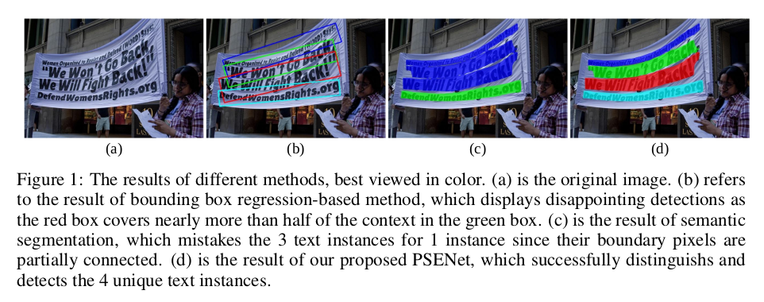
+ 在字符检测领域，传统的矩形框方法难以检测到不规则形状的文字，但在自然环境中这种情况广泛存在，因此基于分割的字符检测方法应运而生
    + 基于分割的字符检测方法在任意形状文字检测上取得了良好效果，但是在字符间距很小时容易出现粘连问题。本文介绍的方法基于以下贡献点解决该问题
    + 设计了多个尺度的特征图卷积核，从最小尺寸的特征图卷积核依次膨胀得到最后结果解决了粘连问题
    + 使用图像腐蚀方法生成了若干训练数据，不需要单独标注
    + 在各个数据集都取得了state-of-art成绩

# 效果描述
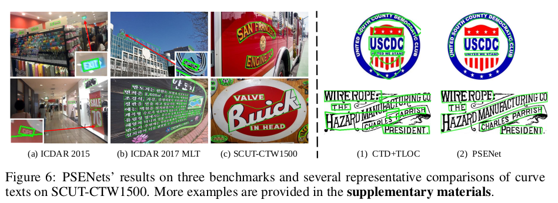
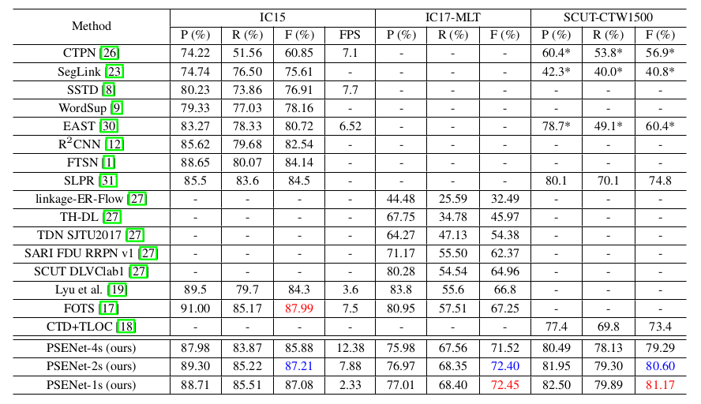
+ 由图可见在IC15,IC17,CTW1500上，PSENet在Precesion, Recall, F1-Score都取得了不错的成绩。

# 模型结构叙述
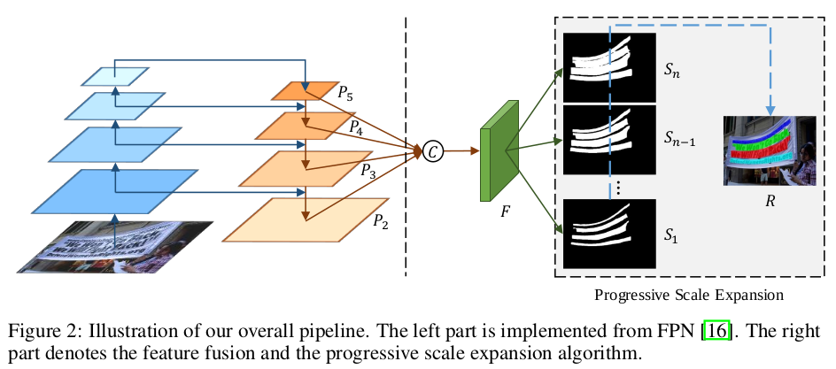
+ PSE网络结构受FPN启发，首先经过若干卷积提取多个尺度的特征图，这里是４个尺度的特征图(P5 P4 P3 P2)
+ 特征图经过上下采样得到融合后的特征图F
+ 单个特征图F被采样处理为多个尺度的特征图卷积核（Sn Sn-1 S1）
+ 在这些特征图卷积核上做最后的分割预测

# 分割预测的膨胀过程
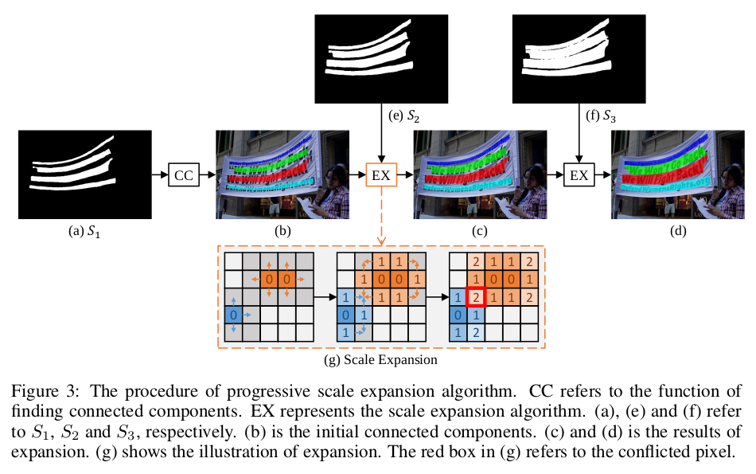
+ 在多个特征图预测得到各自尺度的分割结果后，这些结果需要融合以下是融合过程的概述：
    + 从最小尺度的特征图结果开始融合，依次往最大特征图运算
    + 如果有分割结果冲突，遵从先到先占位原则进行融合 

## 消融研究
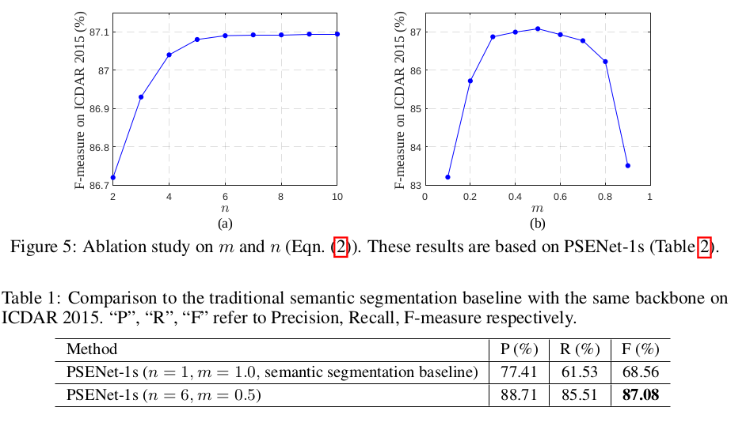
+ m : 缩放比例(最小/原始)　[由图可见，过大或者过小的m都对性能提升不利，取0.5左右的m,能对性能起到贡献]
+ n : 预测特征图个数 [可以看到从预测特征图的逐步增加，F1-Score逐步提升，n=4时到达拐点，n对于性能的提升起到了重要作用]

# 训练及Loss设计
## label生产
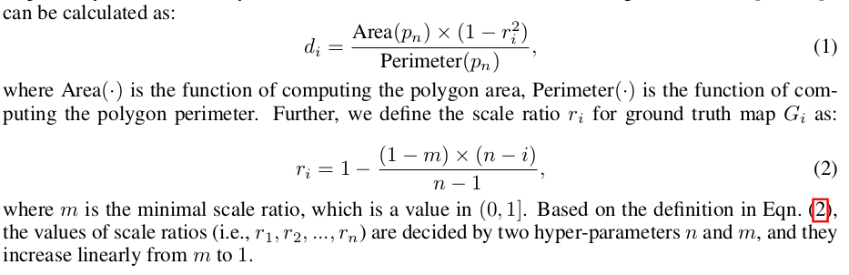
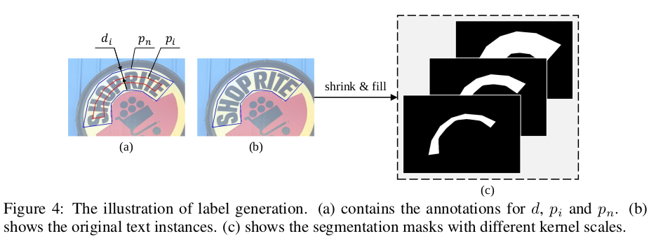
+ 上图介绍了标签生成的规则
    + d 是两个GT之间的缩进距离
    + r 缩放的比例，和m,n有关系，预测特征图越小，r越小
    + Area是求面积函数
    + Perimeter是求周长函数

## Loss
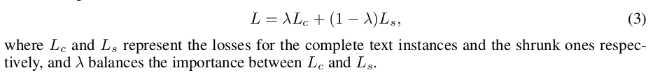
+ Loss由两部分构成，普通分割Lc和缩放膨胀部分Ls
+ λ控制两部分Loss权重

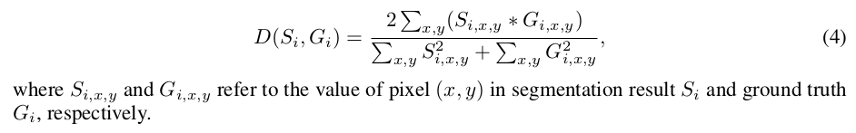
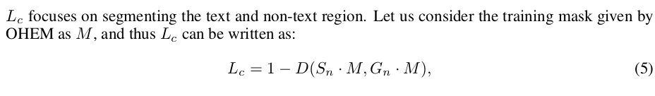
+ Si 是预测像素值
+ Gi 是标注像素值
+ M (Online Hard Example Mining) 训练过程中将部分简单样本和小数量样本进行抑制，提高训练效率,[点我更多信息](http://www.erogol.com/online-hard-example-mining-pytorch/)
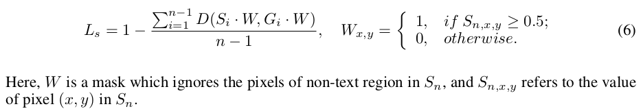
+ Si 是对应尺度预测图的预测像素值
+ Gi 是对应尺度生成的标注像素值
+ Si > 0.5 时，W 取 1 , 其他情况　W 取 0
> 通过这种方式，W过滤掉对应尺度特征图上被腐蚀掉的目标部分。加速训练过程，个人认为如果没有W,应该也能训练出相当的效果，欢迎拍砖

