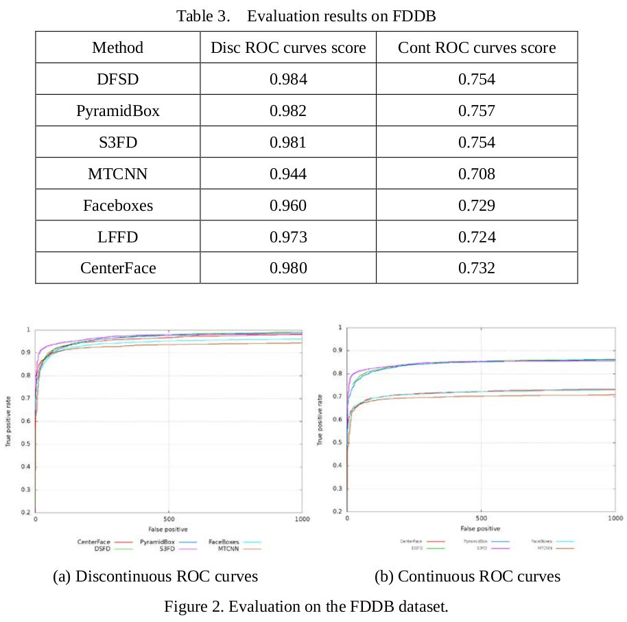
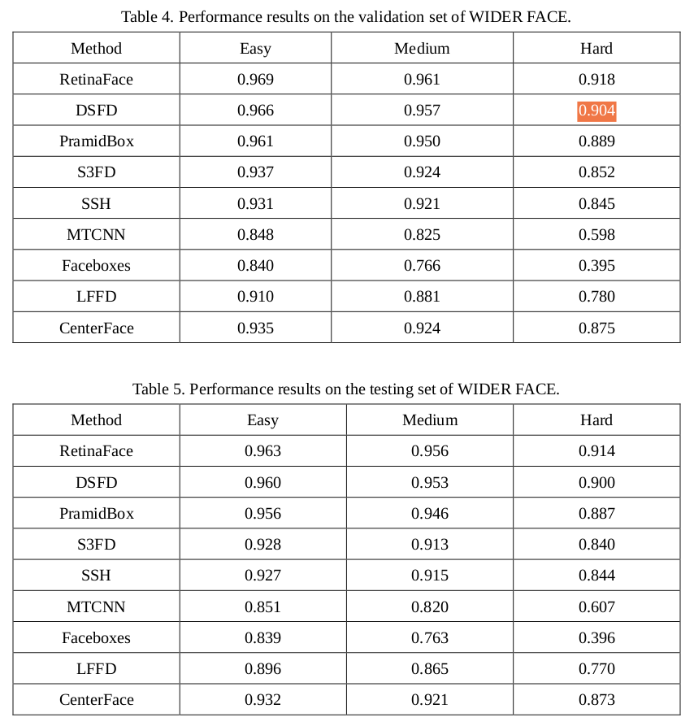
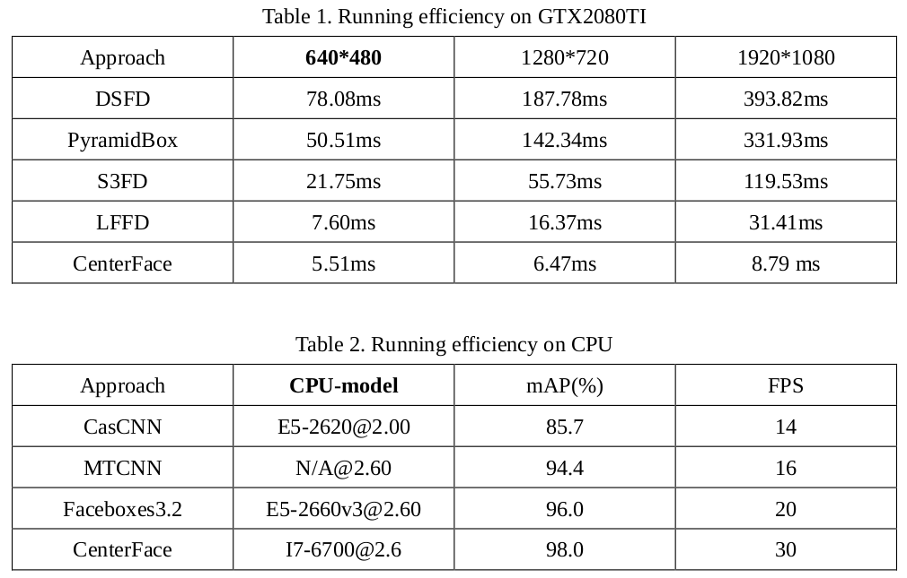
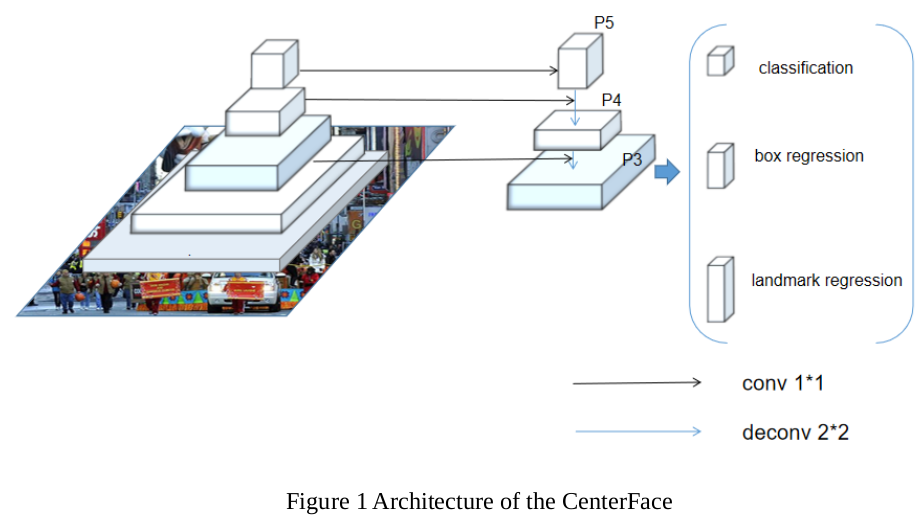
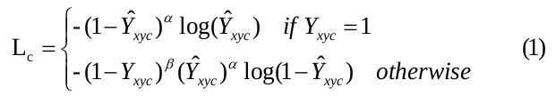
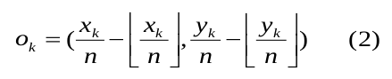
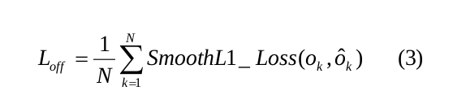
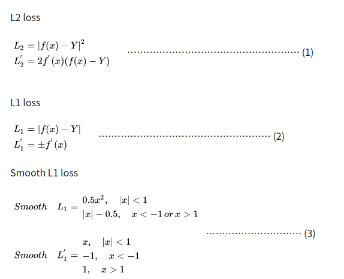
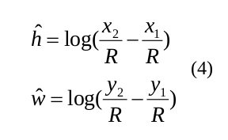
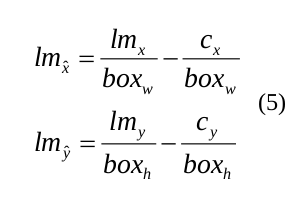

# CenterFace 核心点笔记

looking for papers for [Centerface](https://arxiv.org/ftp/arxiv/papers/1911/1911.03599.pdf)

contributer : [leoluopy](https://github.com/leoluopy)
同步更新位置及其他顶会视觉算法分析：https://github.com/leoluopy/paper_discussing
+ 欢迎提issue.欢迎watch ，star.

# Overview
+ 将人脸检测问题转换为中心点的预测问题
+ 人脸对齐一块儿做，人脸关键点检测效果良好
+ 模型结构轻量化，非常适合在各种计算资源有限的嵌入式设备使用。
+ 在各个数据集上取得了state-art-art 效果

# 效果描述

+ 对比各个人脸检测器在FDDB数据集上的结果差异，CenterFace与更重的人脸检测器（S3FD）没有明显差异。

+ 对比各个人脸检测器在WIDERFACE数据集上的结果差异，CenterFace在收益和计算资源付出方面体现出非常大的收益，其在更难的样本下检测效果优势体现更明显。

+ 在CPU和GPU的同步对比下CenterFace都取得了不错的效果，速率明显快于对比的检测器（S3FD,DSFD）

# 模型结构叙述

+ CenterFace网络结果较为简单，前面的backbone可以为多种网络结构用于提取网络特征
+ 特征图提取完成后，确定相应分辨率的人脸中心点热力图。
    + 热力图直接表征是否为人脸以及人脸长宽，同时回归人脸5个关键点位置。

# 训练及Loss设计
## Loss

+ loss由多个部分构成
    + 人脸热力图分类loss
    + 人脸中心坐标偏移loss
    + 人脸框长宽loss  
    + 人脸关键点归一化坐标loss（以人脸框长宽作为基准做归一化）

+ 关于热力图分类loss，文章采用了类似Focal loss的一种方法，在log函数前方加入指数函数，使简单样本在模型基本收敛时贡献变小，从而实现类似困难样本挖掘的功能。

+ 模型的中心点热力图和真实GT的对应存在一定偏差，loss设计时做这样一个对应利用回归更加准确的人脸框。
    + n 是对应原图的降采样倍数
    + loss使用L1 smooth　loss 下面贴一个 L2 L1 L1 smooth loss公式区别
    
        + L2 loss对于利群点的影响控制不好
        + L1 loss在0点处的到处不唯一
        + L1 smooth loss比较综合以及稳定, 函数实际上就是一个分段函数，在[-1,1]之间实际上就是L2损失，这样解决了L1的不光滑问题，在[-1,1]区间外，实际上就是L1损失，这样就解决了离群点梯度爆炸的问题

+ 人脸框长宽和人脸关键点都使用smooth L1 loss
+ x1,x2,y1,y2是人脸框GT,R是热力图和原始图像的降采样缩放比例
+ 人脸关键点按照人脸框长宽进行了归一化，以人脸中心作为原点。

## 训练细节
+ 训练集使用了WIDER FACE 和 RetinaFace
+ 数据增广使用了随机镜像，缩放，颜色调整，以及随意裁剪图片并缩放至800x800
+ Adam优化器，　batch size: 8 , 5e-4 训练到140epoch, 90 和120epoch ，学习率分别降10倍

## 附加
+ 网络结构中 conv 和 deconv 过程

