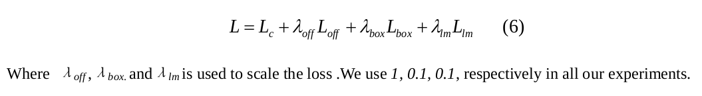

# CenterFace 核心点笔记

looking for papers for [Centerface](https://arxiv.org/ftp/arxiv/papers/1911/1911.03599.pdf)

contributer : [leoluopy](https://github.com/leoluopy)
同步更新位置及其他顶会视觉算法分析：https://github.com/leoluopy/paper_discussing
+ 欢迎提issue.欢迎watch ，star.
+ 微信号：leoluopy，如有疑问，欢迎交流，拍砖

# Overview
+ 

# 效果描述

+ 

# 模型结构叙述

+ 

# 训练及Loss设计
## Loss

+

+

+

+

+

+

## 训练细节

