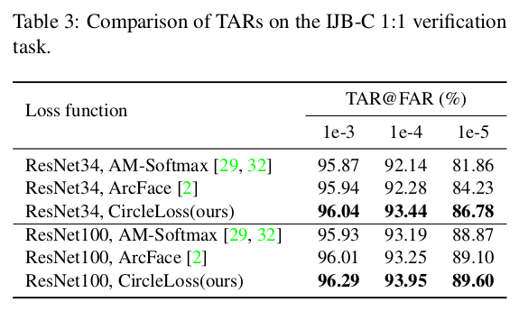
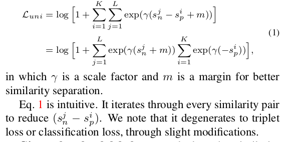
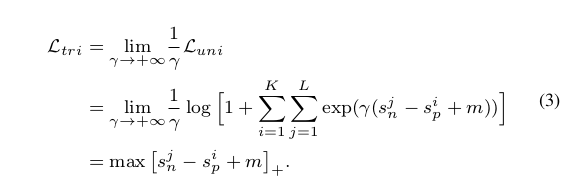
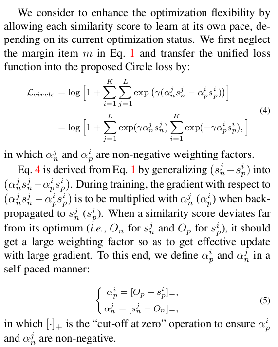

+ 欢迎提issue.欢迎watch ，star.

+ 
> Circle loss. 主要有以下亮点可以做相关的详细描述。
+ 首先第一点circle loss是基于triplet loss，改进而来的一种新型的loss定义。它的改进点在于，原本triplet loss对于正负样本采用平均用力的方式进行优化。使得在模型收敛的时候，对于正负样本的区分力度不够。Circle loss 在正负样本对加入了一个权重，控制正负样本对各自的梯度贡献，最后就可以得到一个更有区分力度的模型。
+ 随后第二点，circle loss 在实现的过程中，同样借鉴了arc face 定义的夹角margin。真大了模型对于各个分类也就是人脸id在训练过程的难度. 最终体现出来其模型有更强的区分力度。
+ 接下来第三点，虽然circle loss是基于triplet loss的一种升级版的 loss 定义。在实现的过程中，如果数据不是成对的pairs ，根据作者的定义，也可以将这些基于分类的数据转化为正负样本对的Pairs.  因此circle loss。也可以叫做是一种提出来新型的Unified loss. 

推荐一个开源实现地址：
https://github.com/leoluopy/circle-loss-demonstration

+ 
> 随后我们从实际的实验角度来看一下circle loss 实际跑分效果。解释一下名词。Far. 是指的false alarm rate。误识别率【这个比较好理解也就是识别错的概率。】。Tar. True alarm rate。正确识别率。【这个指标指的是本来应该被识别对的，却没有被识别正确。】 可以从图中明显的看到在1/10万的错误率的情况下，Circle loss. 相对于其他loss都有比较明显的优势。

+ 
> Circle loss 取得比较好的效果，并且是cv pro2020年的oral。我们从特征的空间维度来分析一下。上图是对circle loss 收敛过程中特征维度的一个描述 。这与普通的triplet loss在左图可以看到，Ab和c都是一个最终收敛可以接受的位置，因此导致了最终区分度不够的问题，而右图也就是circle loss 特征收敛Loss要求 只有c这个位置是更合适的收敛位置。

+ 
> 上图的表述其实不太直观，我们一起来看一下loss的定义吧。首先简要的看一下这个unified loss是如何定义的。如上图所示，gamma是缩放因子。M是margin。是不是特别像triplet loss 。 既然是统一的loss定义，我们一起来看一下它如何被退化为triplet loss或者am soft Max loss。

+ 
> 来看triplet loss。当参数gamma趋向于无穷大的时候，由数学推导求直线，可以将公式直接进行变换，得到第三行。在代码具体实现的时候，根据度量单位的选择，如果是欧式距离，优化方向就是Maximize，如果是余弦相似度，优化方向就是Minimize.
+ 
> 我们再来看一下circle loss是如何退化为am soft Max loss的，这是一个公式根据样本的数量以及分布在物理意义上的转换，也就是说在一定的样本数量和分布上Circle loss可以退换为am soft Max loss。如公式所示，假设有n个class，负样本对有n-1 个 ，正样本对有 1 个 。这时，circle loss 退化为了am soft Max loss。
+ 
> 最后我们再来详细的看一下circle loss的细节定义。激活函数还是soft plus，损失函数由两部分构成，仍然是正样本对和负样本对。样本对之前都有嘎玛因子。在训练的时候用于调参控制样本重要性。另外，正负样本之前同时有alpha因子。随着模型的收敛，假设正样本的相似度已经比较高，根据正样本alpha因子的定义，正样本损失项乘以alpha因子之后，会趋向于贡献更小，如此一来，更利于模型专注于学习收敛相对不佳的样本。

