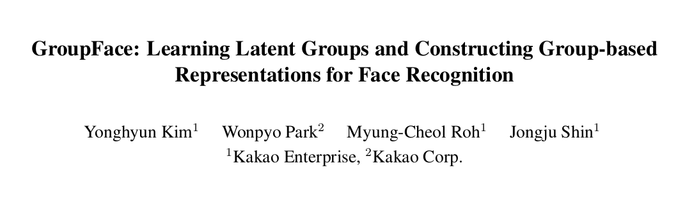
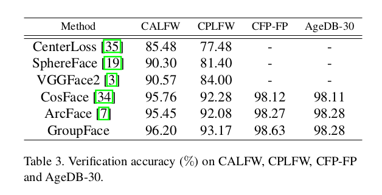
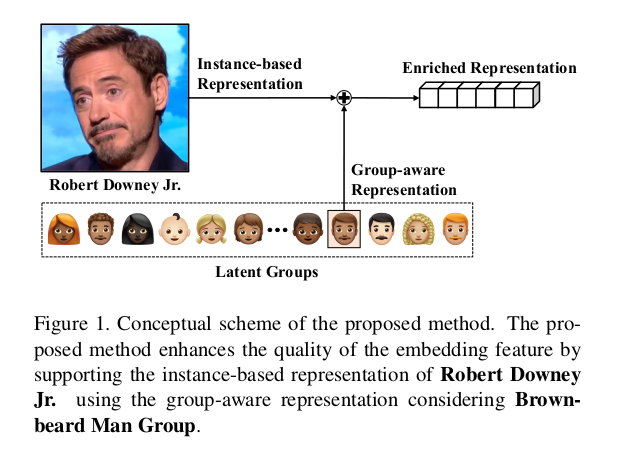
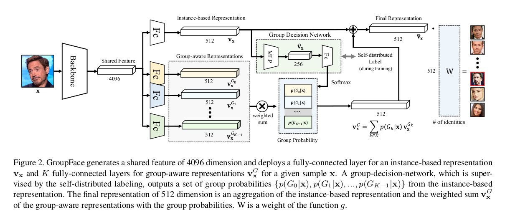
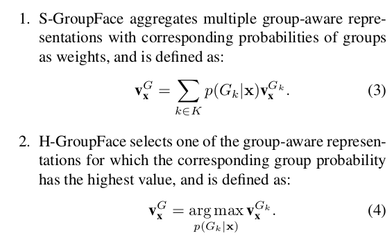
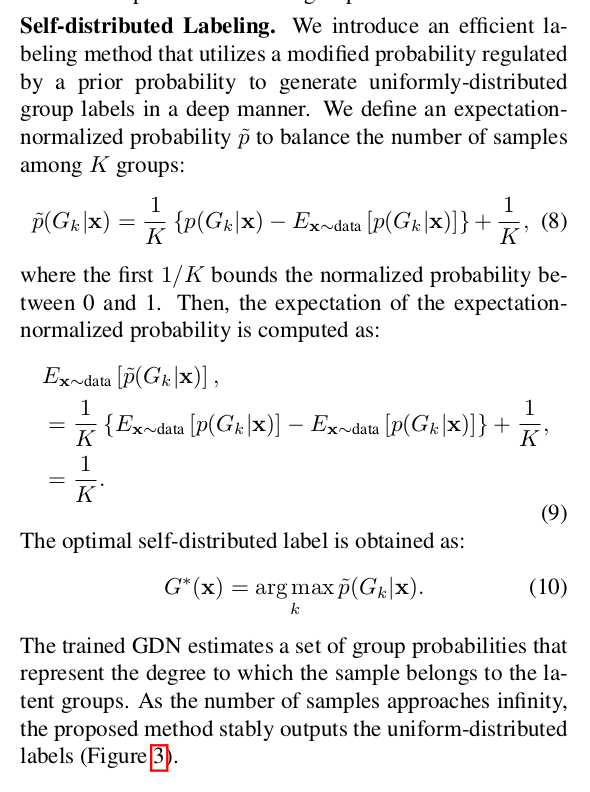
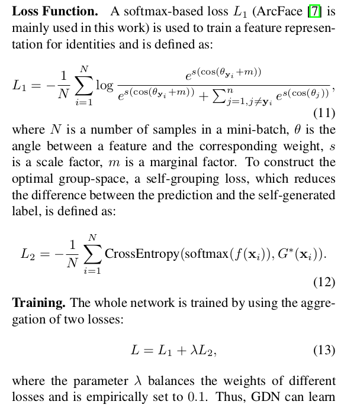

+ 欢迎提issue.欢迎watch ，star.
+ 微信号：leoluopy，如有疑问，欢迎交流，拍砖

+ 
> 近几年，人脸识别的研究方向大多在改进loss，从而来提升人脸识别的精度。Cvpr2020的这一篇group face别出心裁，采用改进网络结构定义的方式来提升了识别的精度，并且在各大数据集上刷新了记录。首先来说一下group face最核心的贡献点在哪里？通过改进网络结构的方式，引进特征分组并且学习特征分组，本质就是引入了额外的监督信息。

+ 
LFW的指标已经几乎达到极限，来看一下CALFW和CPLFW以及CFP的数据集性能。可以看到都得到了一定的提升。

+ 
> 首先来看一下group face的整体思路。一副人脸经过卷积网络之后，得到一个instance based representation ，同时Group face 学习到了一个group aware representation，其本质就是对原始特征进行了一个修正，从而得到了一个有更好区分性的特征。
+ 
> 这样一来，我们从网络结构详细的看一下这个修正的特征是如何得来的。首先，骨干网络提取特征得到最末尾的中间特征。中间特征经过全连接层得到原始特征，或者通过一系列的全连接层得到若干不同的特征分组。原始特征通过GDN网络。【Group decision network. 】得到每一个分组的概率。特征分组通过这个概率融合得到最终的特征修正矢量。这个矢量叠加到原始特征之后就得到了能够具有更高区分能力的特征。
+ 
>整个流程其中有几个细节我们一起来看一下。特征融合的方式有两种，如上图公式所示，第一种是根据GDN网络所得到的每组特征不一样的概率，求所有特征最终的期望。第二种是根据GDN网络所得到的每组特征概率，直接取最大概率的对应组特征作为最后输出特征。
+ 
    + 接下来看的第二个细节是GDN网络在训练时对输出概率的预处理。上面公式看着挺复杂，概括成一句话挺简单: 从全局样本根据分布，设定每一个组平均分布，并调整每一个batch的概率估计，从而满足全局范围内每一个组概率平均分布。
    + 如果不进行此项概率的规划，那么学习到的GDN网络倾向于过拟合到特定的一个或者几个组。
+ 
> 最后来看一下损失函数的设计。仍然有两部分构成，一部分是arc face loss 用于直接训练人脸分类特征。一部分是cross entropy 用于训练GDN网络。

推荐一个开源实现地址：
https://github.com/leoluopy/GroupFacePytorch