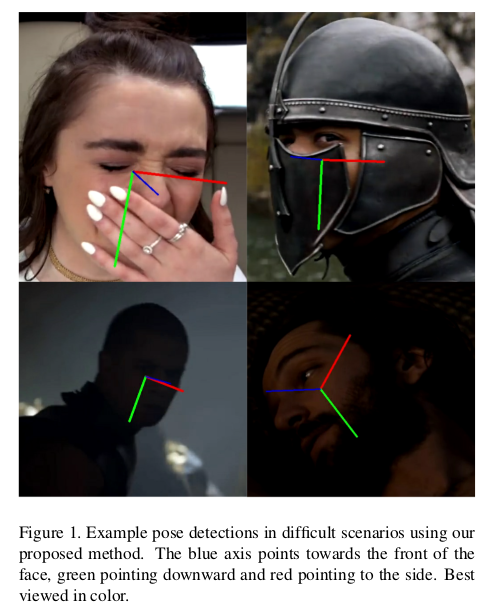
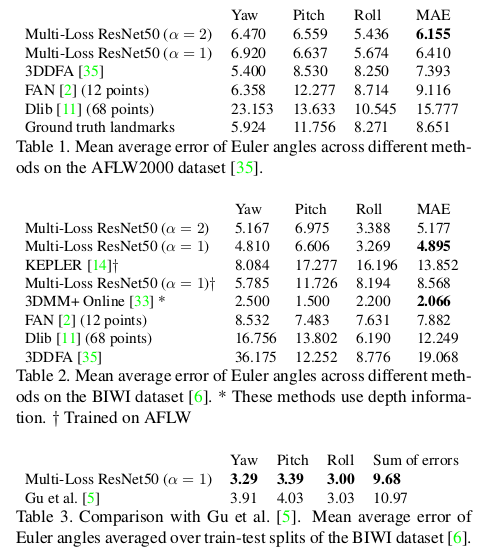
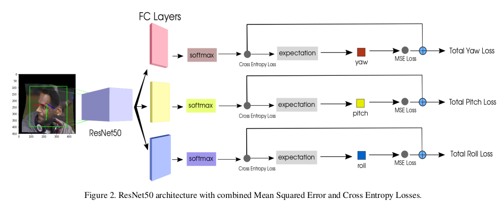
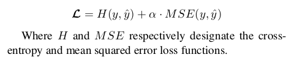
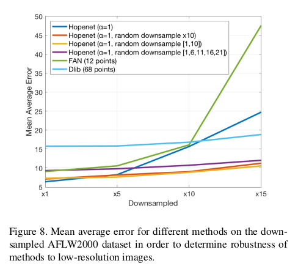

# HopeNet 核心点解析

looking for papers for [HopeNet](https://arxiv.org/abs/1710.00925)

contributer : [leoluopy](https://github.com/leoluopy)

+ 欢迎提issue.欢迎watch ，star.
+ 微信号：leoluopy，如有疑问，欢迎交流，得文时浅，或有纰漏，请不吝指教。

# Overview
+ 
+ 在这之前人脸姿态的估计基于已经检测好的人脸关键点，或者结合深度信息来估计人脸姿态；这样带来的缺点是或者检测精度
严重依赖关键点的精度，效果受到图像模糊度重大影响，或者需要比较昂贵的深度数据重建3DMM模型。本文提出了一种直接使用特征图回归
 人脸各个方向角度的方法，即三个角度使用共同特征提取后面接三个不同FC+softmax+期望转换层，回归得到不同角度
+ 为了使模型得到良好的收敛，文章设计了双loss结构，crossEntropy负责控制回归粒度比较粗的角度基点，MSE负责控制回归基于刚才角度基点的
期望调整
+ 在数据增广方面，这个模型生成了人脸姿态数据和各种角度的模糊人脸数据可以大幅度提升模型的精确度

# 效果描述

+ 在除了基于深度信息的人脸角度回归模型中，HopeNet取得了目前最好的效果，在你的工程没有深度信息，或者没有关键点，是一个
不错的选择。同时基于这个思想我们可以方便的替换骨干网络[文章使用的是resNet50]
# 模型结构叙述

+ backbone 采用了resNet50
+ FC 全连接层做了一个维度转换和特征表达转换，将resNet50最后的2048维空间转换为66维特征,FC后直接跟softmax
+ Outscore= ∑(socre[i] * Es)
    + score[i] 是对应全连接层回归后求softmax结果, Es是每个角度基点的期望固定值。
    + i 的累加范围是66个【文章把-90到90度】每3度做一个角度基点，每个角度基点是crossEntropy的loss计算依据.

# Loss及训练方法

+ H是crossEntropy交叉熵
+ Loss 分为两部分crossEntropy用于控制分类回归角度的角度基点，MSE用于控制基于角度基点的期望调整

+ 其中a是训练loss中两个子loss权重因子
+ random downsample x10 : 缩小10倍然后放大回来 [这样使用中间插值的缩放方法，回来的图像就模糊了]
+ random downsample [1,10] :1-10之间随机倍数
+ random downsample [1,6,11,16,21] :在1,6,11,16,21中随机选用缩放因子

