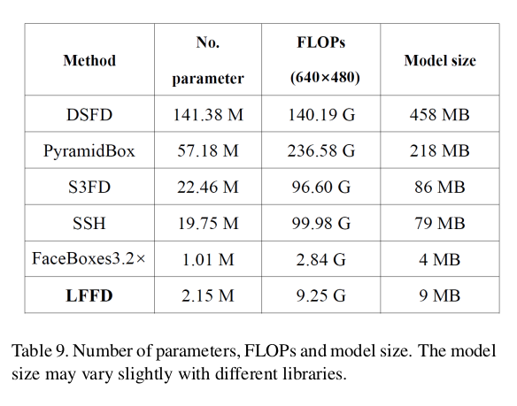

# LFFD 核心点笔记

looking for papers for [LFFD](https://arxiv.org/abs/1904.10633)

contributer : [leoluopy](https://github.com/leoluopy)

+ 欢迎提issue.欢迎watch ，star.
+ 微信号：leoluopy，如有疑问，欢迎交流，得文时浅，或有纰漏，请不吝指教。

# Overview
+ 在检测领域中，基于anchor的方法，目前来看是主流方案，本文新颖的提出了anchor free 的方案，并且在人脸检测的子领域
中取得了非常不错的效果，在类比精确的人脸检测算法的情况下，牺牲了极少的精度，换取了非常大的速率提升。
+ 本文实现anchor free 的检测方案重新定义了backBone特征提取结构
+ 在重新设计网络之前，本文重新梳理了感受野相关理念和理解。

# 效果描述
+ 
+ 上图是在FDDB数据集上的ROC曲线结果
+ 连续和非连续的解释 
    + 定好一个阈值之后，根据超过此阈值定和低于此阈值，就可以得出混淆矩阵，
    + 对于每个混淆矩阵，我们计算两个指标TPR和FPR,以FPR为x轴，TPR为y轴画图，就得到了ROC曲线
    + 这种定好阈值，单个混淆矩阵画ROC曲线称之为非连续ROC曲线
    + 如果在上述模型中我们没有定好阈值，而是将模型预测结果从高到低排序，将每次概率值依次作为阈值，那么就可以得到多个混淆矩阵。
    + 这种多个阈值，多个混淆矩阵相叠加得到的ROC曲线，称之为连续ROC曲线
> 连续ROC曲线因为有取到更低的阈值，往往更加严格，得分更低。
+ 
+ 在WIDER FACE 中的结果，分为多个子数据集的对比
+ 
+ 运行效率对比，比S3FD快大约３倍，比DSFD快大约10倍。

# 核心点叙述
+ 
+ 在实际图像中，感受野就是自然存在的anchor,
+ 
+ 

 

# 模型结构叙述
+ 
+ 

# 训练及Loss设计
+ 

# TIPS
+ 
+
+ 

