# Light-CNN 核心点解析

looking for papers for [Light-CNN](https://arxiv.org/abs/1511.02683v2)

contributer : [leoluopy](https://github.com/leoluopy)

+ 欢迎提issue.欢迎watch ，star.
+ 微信号：leoluopy，如有疑问，欢迎交流，得文时浅，或有纰漏，请不吝指教。

# Overview
+ 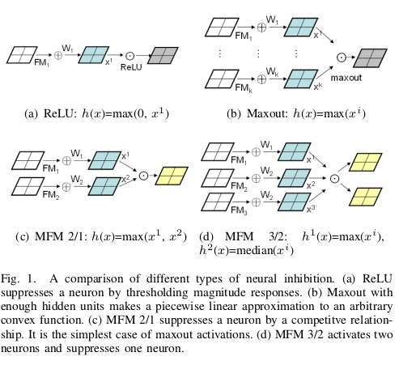
+ LightCNN受神经元抑制启发，提出了MFM的一种新的特征图融合方法，在特征提取效果和特征提取速率方面取得了很大进步
+ LightCNN训练使用了一套BootStrap方法，使得有噪音的大型数据集能够卓有共享贡献的训练模型，并取得的良好效果

# 效果描述
+ 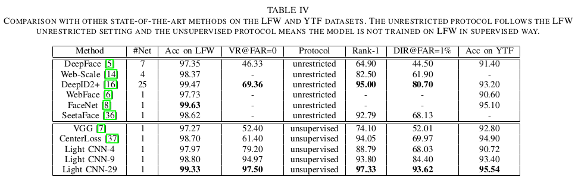
+ 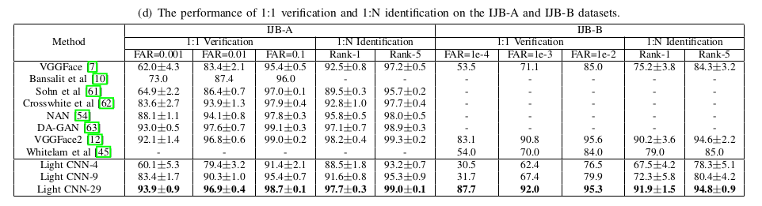
从LFW和IJB数据集来看，LightCNN取得了同期媲美start-of-art水平，并且由于其网络轻量，在速率方面有不少优势
+ 速率和参数对比。

+ 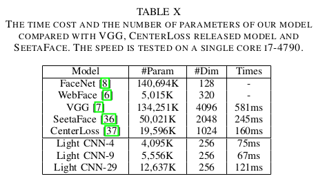

# 核心点叙述
+ 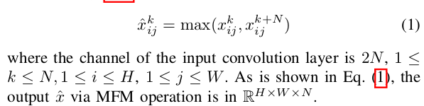
+ 上图即是LightCNN提出的核心MFM1/2操作layer
    + 操作输入是两个通道，特征图长高,W,H,MFM取其中每一个特征图的像素点对应的最大值。
    + 两个特征图经过MFM操作后变为一个特征图，长高不变。通道减半。
+ 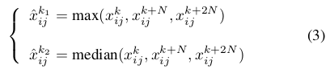
+ 除了MFM1/2，文章还提出了MFM2/3操作layer
    + 与MFM1/2不同的是，这个操作layer输入是三个通道，输出是两个通道
    + 输出的通道1，取输入三个通道对应特征图像素的最大值
    + 输出的通道2，取输入三个通道对应特征图像素的中间值

+ 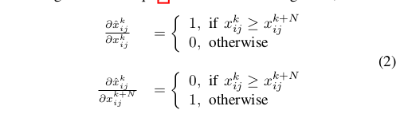
+ 讲完了网络的前向传播，再看梯度，如上图所示MFM的梯度定义是：
    + 两幅特征图经过前向传播，谁的特征图像素大，谁就有梯度，并且梯度为1

# 模型结构叙述
+ 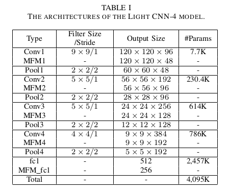
+ 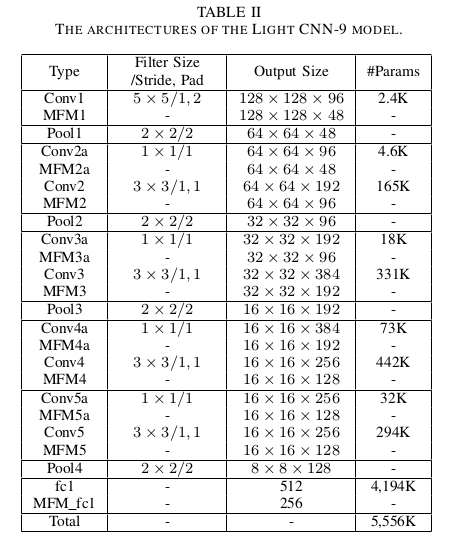
+ 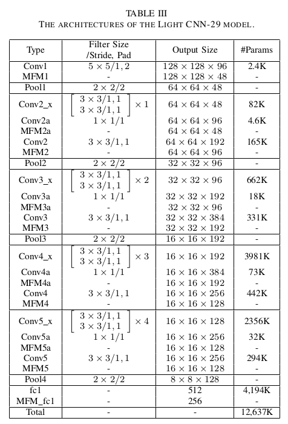
+ 三个模型中MFM即是本文提出的操作符
+ conv2_x,conv3_x,conv5_x 这些是卷积层的堆叠

# 训练方法
+ 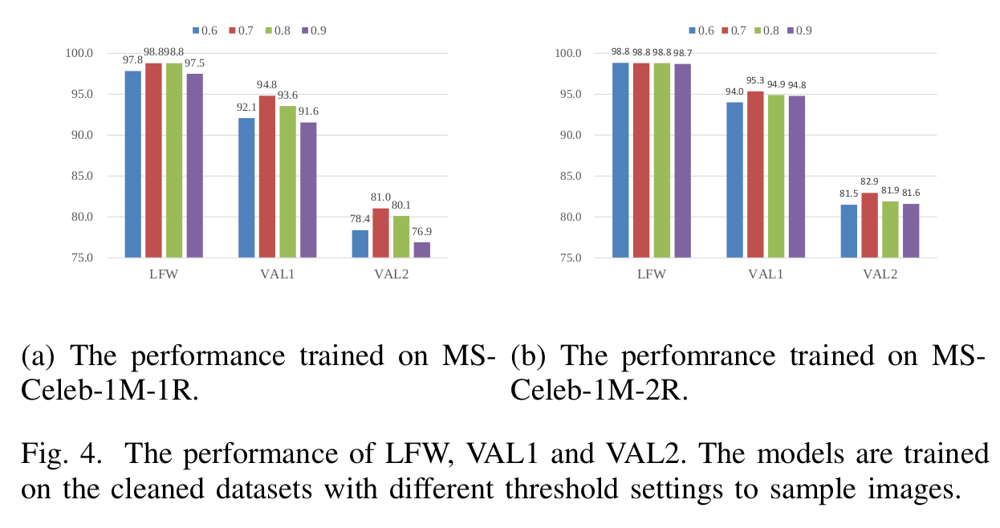
+ 第一步，先在相对准确数据集[CASIA-WebFace]训练，然后在有噪音数据集[MS-
Celeb-1M]进行finetune,为降低收敛难度，只训练分类器，快收敛时，全部训练并递减学习率从1e-3 到 1e-5。
+ 第二步，在噪音数据集预测，预测与label保持label,若不一致，高于阈值的的预测修改label为预测结果，修改后得到　MS-1M-1R
+ 第三步，使用数据集　MS-1M-1R　进行 retrain ,在重复relabel得到数据集MS-1M-2R
+ 第四步，使用数据集　MS-1M-2R　再次训练　，　MS-Celeb-1M数据集人脸ID变少，模型效果变强。

