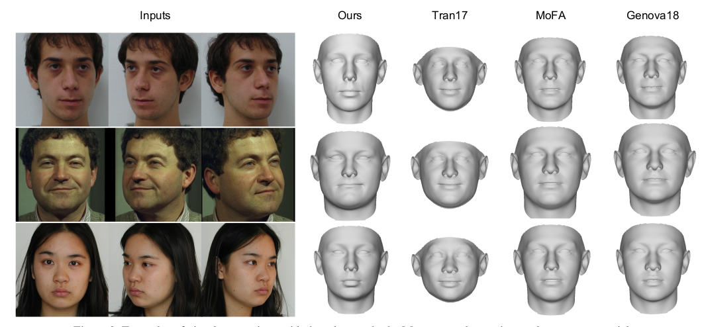
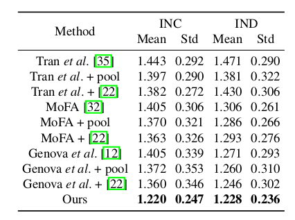
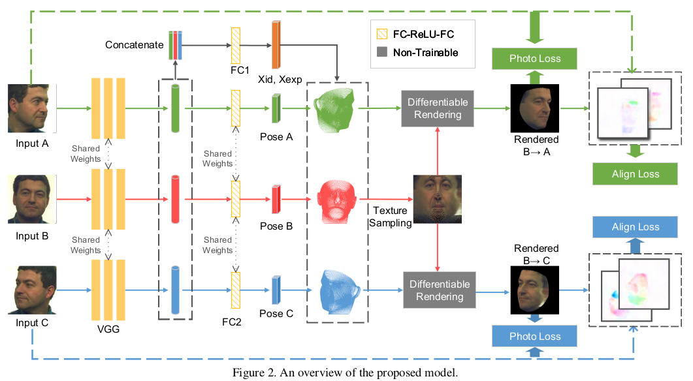

# MVF-Net 核心点解析

looking for papers for [MVF-Net](https://arxiv.org/abs/1904.04473)

contributer : [leoluopy](https://github.com/leoluopy)

+ 欢迎提issue.欢迎watch ，star.
+ 微信号：leoluopy，如有疑问，欢迎交流，得文时浅，或有纰漏，请不吝指教。

# Overview

# 方法叙述

