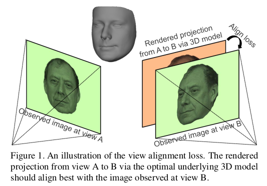
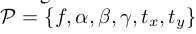
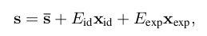
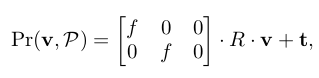
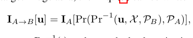
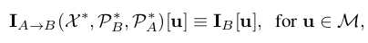
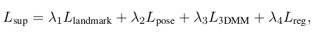
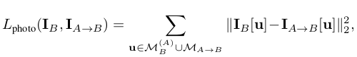
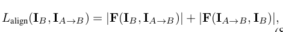
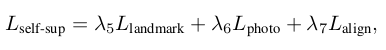

# MVF-Net 核心点解析

looking for papers for [MVF-Net](https://arxiv.org/abs/1904.04473)

contributer : [leoluopy](https://github.com/leoluopy)

+ 欢迎提issue.欢迎watch ，star.
+ 微信号：leoluopy，如有疑问，欢迎交流，得文时浅，或有纰漏，请不吝指教。

# Overview
+ 人脸三维建模是一个长期研究的课题，人脸三维数据稀少，并采集成本高，人脸三维重建的监督学习发展遇到不小瓶颈，
本文提出了一个人脸三维重建的半监督学习方法，并超越了不少同时期其他state-of-art方法。

> 在数据集MICC上和其他方法的对比，均有不同程度的提升。

> 实现效果的另一侧面说明，由此也可以发现实现最终精度误差大约在1cm左右。

# 方法叙述
+ 
+  
+ 
+ 
+ 
+
+  

# 训练方法
+ 

# 投影描述和Loss设计

+ 
+ 
+ 

## 监督训练Loss
+ 

## 无监督训练Loss
+ 
+
+ 
+
+ 

