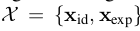

# MVF-Net 核心点解析

looking for papers for [MVF-Net](https://arxiv.org/abs/1904.04473)

contributer : [leoluopy](https://github.com/leoluopy)

+ 欢迎提issue.欢迎watch ，star.
+ 微信号：leoluopy，如有疑问，欢迎交流，得文时浅，或有纰漏，请不吝指教。

# Overview
+ 人脸三维建模是一个长期研究的课题，人脸三维数据稀少，并采集成本高，人脸三维重建的监督学习发展遇到不小瓶颈，
本文提出了一个人脸三维重建的半监督学习方法，并超越了不少同时期其他state-of-art方法。

> 在数据集MICC上和其他方法的对比，均有不同程度的提升。

> 实现效果的另一侧面说明，由此也可以发现实现最终精度误差大约在1cm左右。

# 模型叙述
+ 
+  本文提出了一种使用多角度人脸相互投影并且对投影误差进行不断优化，这样得出了一种半监督学习的人脸三维建模方法。投影思路
见上图
+ 
    + 本文使用的模型结构如上图所示，输入为三幅人脸图像 A/B/C 分别如图所示，两个侧脸和一个正脸
    + 收到人脸使用相同权重提取特征，这里使用的VGG  【上图左边黄色部分】 ,可以是其他特征提取模型例如[EfficientNet](https://github.com/leoluopy/paper_discussing/blob/master/general/efficientNet/efficientNet.md)
    + 提取到三个人脸的特征concat在一块儿，随后几层全连接层回归3DMM参数。
        +  
        + s上横线　【markdown 没办法打】　：　表示BFM模型建立时那群高加索模特的3D模型的平均基础值 
        + Eid :　表示人脸ID向量的basis
        + Eexp :　表示人脸表情向量的basis
        + Xid :　表示被回归得到的人脸ID向量[199维]
        + Xexp :　表示被回归得到的人脸表情向量[29维]
    + 提取到三个人脸的特征不concat一块作为另一个分支，使用共享全连接权重，回归人脸位姿 (Pose A, Pose B, Pose C)
        + 
        + f : 表示投影参数，投影方程见后文
        + α,β,γ : 表示投影所需的欧拉角，转投影矩阵使用
        + tx,ty : 表示投影平面上x,y的basis
    + 上图中还有提到比如PhotoLoss,AlignLoss 是对训练Loss设计在整个架构的示意。下文介绍

# 训练方法

> 监督训练和无监督训练向结合，首先监督学习快速下降loss,而非直接进行无监督学习，从而避免进入局部最优点；监督学习
训练若干个epoch或者收敛（原文没有说明），之后进行无监督学习，其思想是：使用三个角度人脸，正面，左侧，右侧人脸进行
相交部分的相互投影（相交部分由关键点并过滤得来），投影之后相交部分应该在纹理颜色，还有光流特征，以及人脸关键点部分
具有极高相似度，对此部分进行loss优化即是本文方法的最核心点。

# 投影描述
+ 
    + 查上文中模型描述，有回归得到的以上的模型参数，这个模型参数会在下面的投影方程中使用。
+ 
    + R 是有欧拉角转换得到 3x3　的投影矩阵
    + v 是三维空间中　[x,y,z]　的坐标转置
    + t 是basis
    + 综合看维度= [2x3]*[3x3]*[3x1] + [2x1] = [2x1] 得到投影二维平面坐标
+ 
    +  
+ 

## 监督训练Loss
+ 

## 无监督训练Loss
+ 
+
+ 
+
+ 

