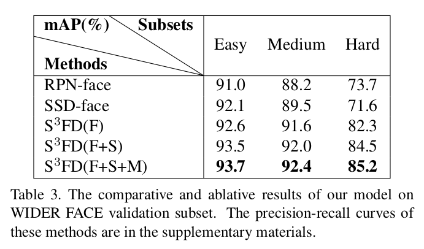

# S3fd 核心点笔记

looking for papers for [S3fd](https://arxiv.org/abs/1708.05237)

contributer : [leoluopy](https://github.com/leoluopy)

+ 欢迎提issue.欢迎watch ，star.
+ 微信号：leoluopy，如有疑问，欢迎交流，得文时浅，或有纰漏，请不吝指教。

# Overview
+ 人脸检测领域作为通用目标检测中特定目标的检测，目前有很大的发展，但是在小目标和非标准困难目标的检测中仍然是挑战，本文在相应的难题中
从改善anchor着眼提出了以下几点改善，大大提高了recall
+ 从感受野均匀分布，anchor大小均匀分布重新设计了anchor分布规则
+ 训练中对anchor匹配做了相应的补偿和过滤，使得原本没有学习空间的anchor有更多的学习机会
+ 在anchor分布改善后出现的大量微小负样本anchor,本文使用了maxOut分类方式进行抑制也对recall提高做出了贡献

# 效果描述
+ 
> AFW上的precision,recall指标表现
+ 
> PASCAL上的precision,recall指标表现
+ 
> FDDB上的ROC[TPR/FPR]指标表现
+ 
> WIDERFACE上各个子数据集的precesion,recall指标表现

> PR曲线物理意义：在越来越低的漏检率时，正确率有多少　　【主要目标，对一定情况下，漏多少】

> ROC曲线物理意义：在一定的错误次数或者错误率时，正确率或者正确次数是多少　【主要目标，对一定情况下，有多次错误出现】

# 核心点叙述
+ 
+ 为解决传统目标检测领域存在的问题，首先本文明确了anchor方法存在的问题：
    + 在小人脸情况下，特征在anchor中的提取不足
    + 在anchor一定情况下，和目标人脸不匹配
    + 在设计小anchor时，在一定大小的特征图中，会出现异常多的负样本，因为他们感受野下的目标都不是人脸
+ 
+ 
+ 解决anchor本文提出了第一步：均匀的分布人脸anchor
    + 如上图所示在各个不同的特征图上，不同的Anchor尺寸，按照 N/4滑动，均分分布在特征图上
    + N 是anchor的尺寸
    + RF是感受野，这里指当前做回归的特征图的一部分
+ 
+ 上表对应了在不同的的预测特征图上对应的anchor数量，Scale为16时【也即是anchor为16】时，anchor最多。

+  
> max-out background 代码实现

+ 

# 模型结构叙述
+ 

# 训练方法
+ 

# 附加知识点笔记
+ [ L1 L2 L3 loss ]

