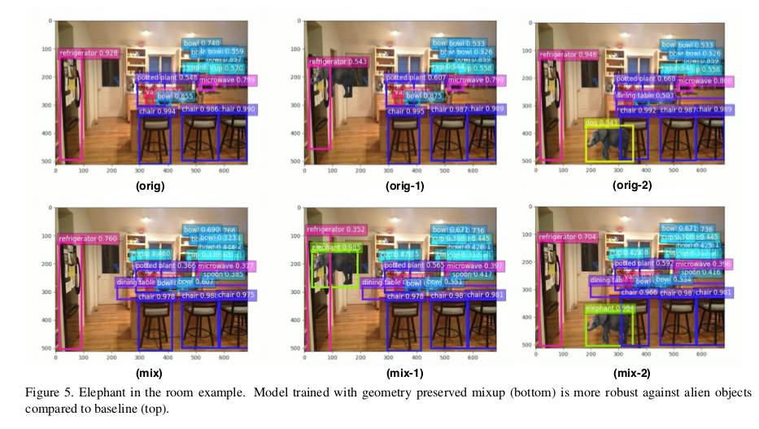
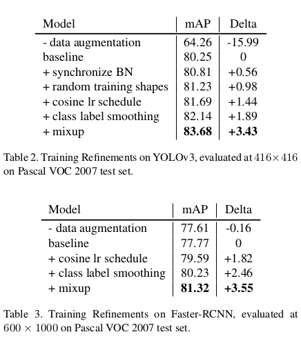

# BoF(训练技巧，论文笔记及讨论)

looking for papers for [Bag of Freebies for Training Object Detection Neural Networks](https://arxiv.org/abs/1902.04103?context=cs.CV)

contributer : [leoluopy](https://github.com/leoluopy)

+ 欢迎提issue.欢迎watch ，star.
+ 微信号：leoluopy
+ 关注AI前沿技术及商业落地，欢迎交流

# Overview
+ 在大环境大家都在比拼模型设计，机器训练资源情况下，作者提出了一些了训练技巧，不改变任何网络结构在各种检测网络中都取得了不错的提升效果
+ 同步BN(如果多卡)
+ 随机图像尺寸采样
+ cosine学习率衰减
+ label-smooth标签平滑
+ mixup图像融合叠加

# 提升效果

> 上图的标准是COCO的mAP值，YOLO提升最大达到５个点，

> 上图是一个典型举例，数据集存在一个场景采样限制问题，如上图所示大象基本不太可能出现在家里（家里装不下嘛）
基于这样的数据集神经网络很可能学习到数据的这样隐式依赖，大象不会出现在房屋中。从而降低了检测器效果。

> 作者提出或者说改进的mixup方法就解决这样的问题。

# 开源实现
+ YOLO实现[传送门](https://github.com/leoluopy/yolo_bof)

## 同步BN
+ BN已经在神经网络的训练中得到了广泛的运用，随着训练数据集的不断增大，多卡，多机器训练成为趋势，各个batch被切分
为更小的batch在各个卡和各个机器中训练，基于BN的公式，多卡和多机器训练时，梯度分量计算会产生差异。这种差异在分类任务中不明显，在检测任务中影响会比较大。
+ 同步BN在运算不同机器或者显卡梯度分量前会首先同步，从而保证期望和方差一致性。

## 随机图像尺寸
+ 随机图像尺寸比较常规，就是YOLO这样的类似全卷积网络中，为了防止模型对图像尺寸产生过拟合输入图像进行不同scale的缩放，以YOLO3为例(416-608之间32为间隔，随机缩放)

## cosine学习率
+ 

## label smooth 标签平滑

+ 

## 图像mixup混合

+ 

## 各个方法的贡献统计

+ 

