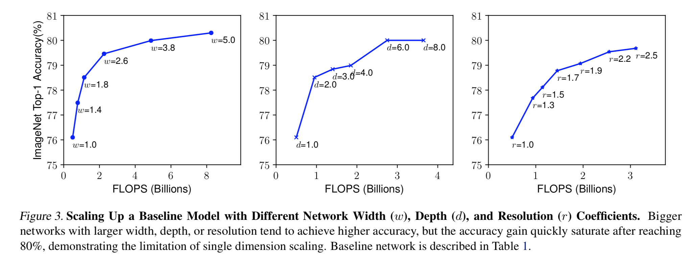

# EfficentNet核心点解析

looking for papers for [Efficent Net](https://arxiv.org/pdf/1905.11946.pdf)

contributer : [leoluopy](https://github.com/leoluopy)

+ 欢迎提issue.欢迎watch ，star.
+ 微信号：leoluopy，欢迎交流

# Overview
随着深度学习的研究，网络的优化和网络的裁剪是近年来十分热门的话题，深度学习从业者在对模型进行优化时，常常有几句话挂在嘴边，把网络加深加宽，网络的性能就会得到提升，
那么如何加深加宽网络是最高效的？之前更多是一门玄学，但是其中其实包含了规律，本文EfficeintNet解答了这个问题，提出了一种以指定方式加深加宽网络的方法大幅度提升了网络的
✅速率并取得了state-of-art成绩
+ 使用网络搜索方法，提出了EfficientNet-B0 基础模型
+ 找到一组有效的加深加宽网络方法，取得最好ImageNet特征提取成绩，并大幅度提升网络速率。
> 具体效果看下图

+ B0 对比mobileNetV2 和 shuffleNetV2

# 方法叙述

+ 卷积模型公式表达

+ baseline网络搜索结构

> 解释

+ 拿到一个网络我们如何优化网络

