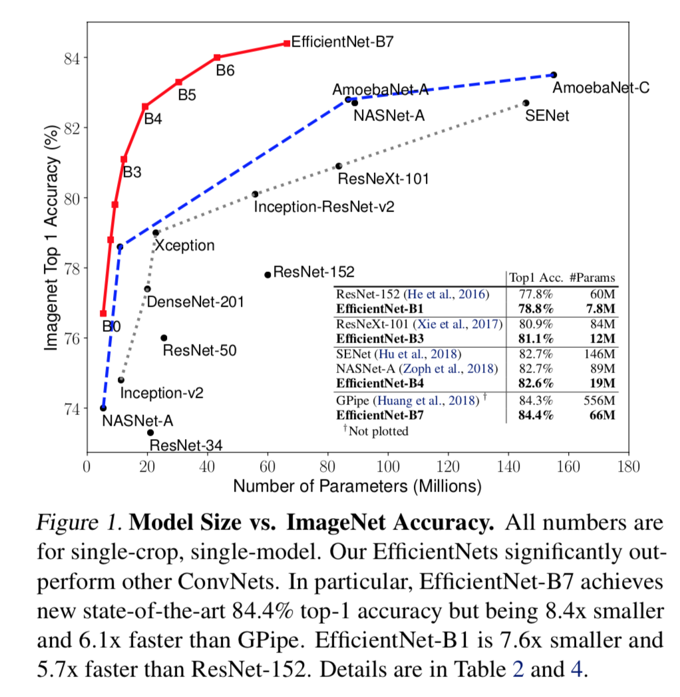
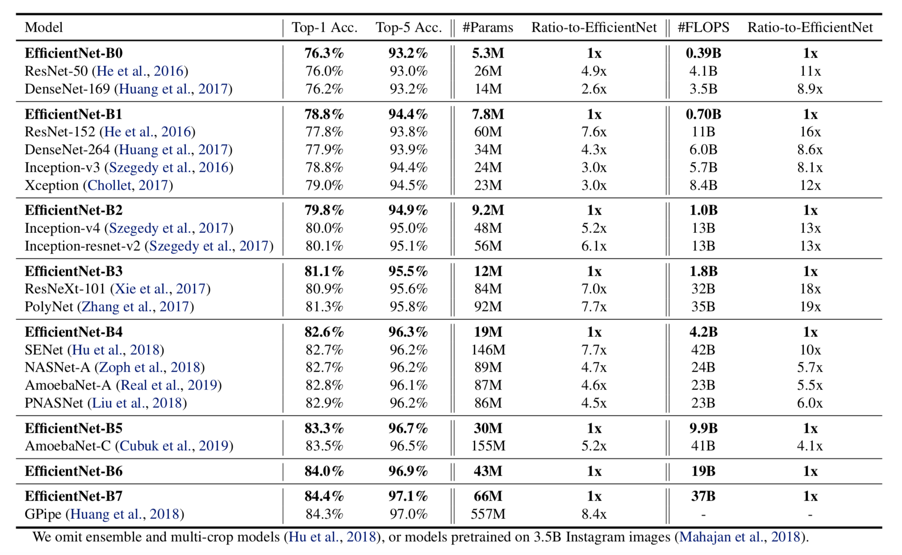
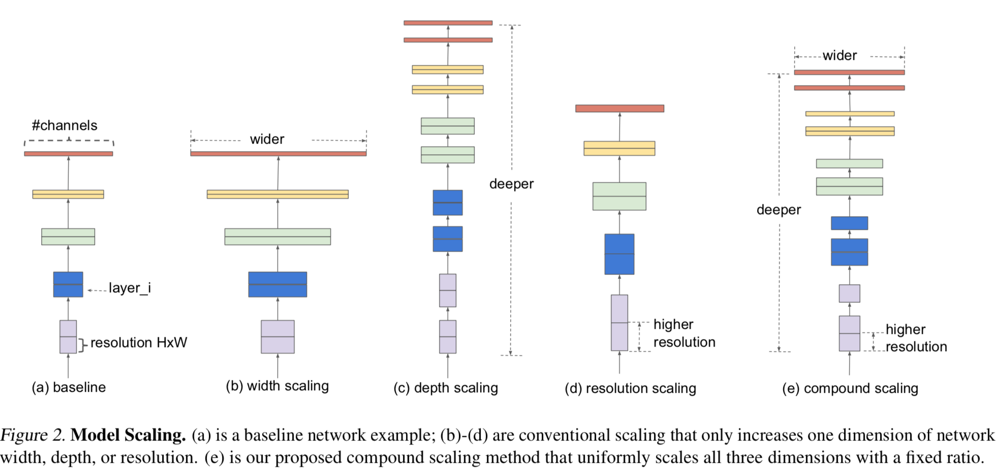
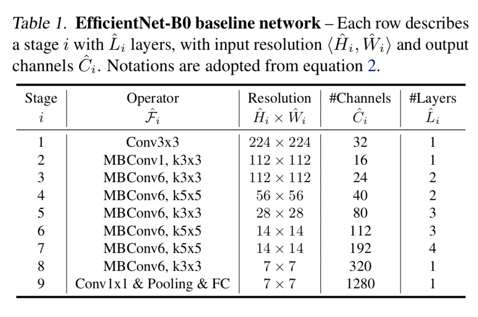
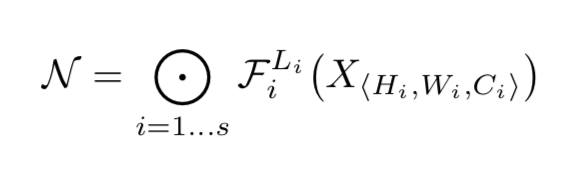
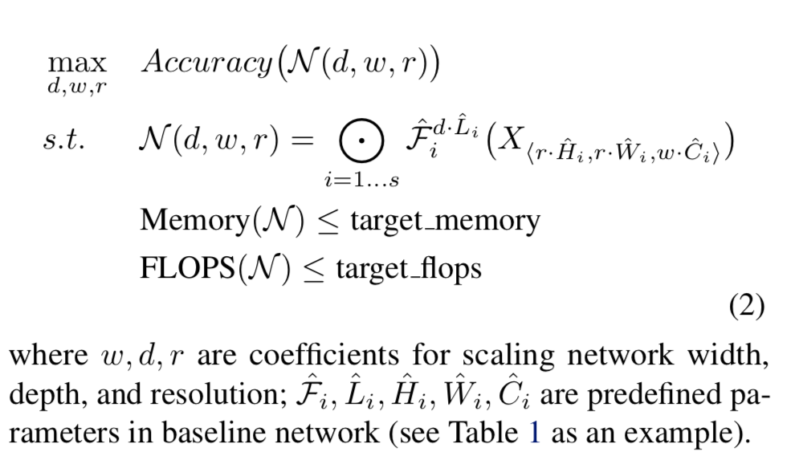
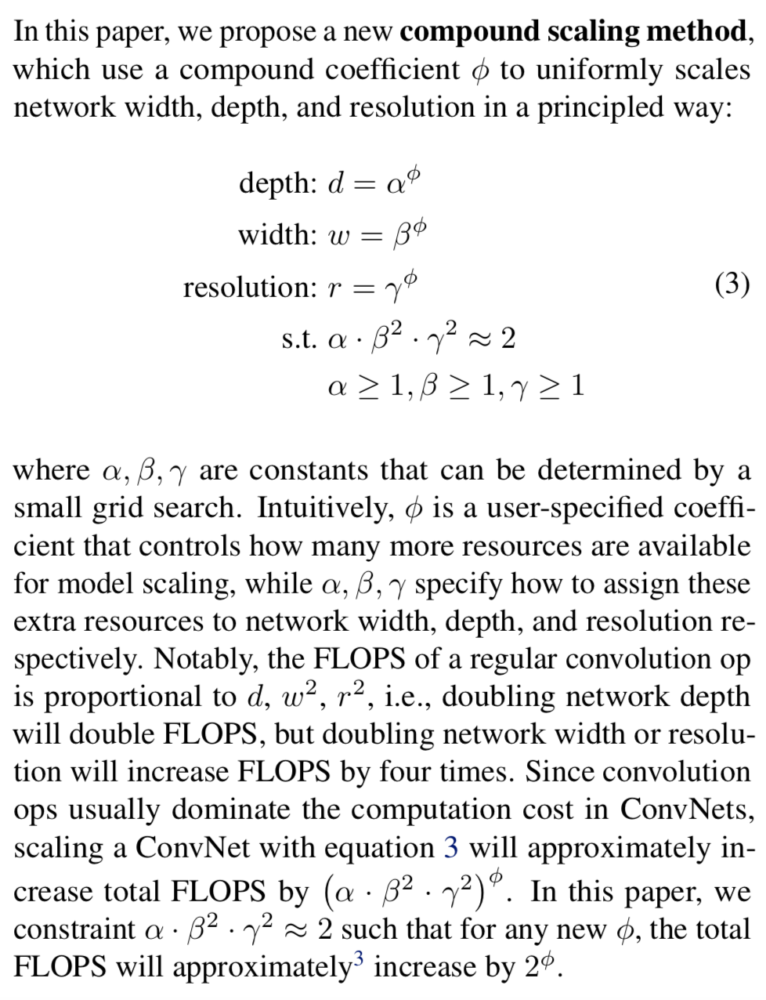

# EfficentNet核心点解析

looking for papers for [Efficent Net](https://arxiv.org/pdf/1905.11946.pdf)

contributer : [leoluopy](https://github.com/leoluopy)

+ 欢迎提issue.欢迎watch ，star.
+ 微信号：leoluopy，欢迎交流

# Overview
随着深度学习的研究，网络的优化和网络的裁剪是近年来十分热门的话题，深度学习从业者在对模型进行优化时，常常有几句话挂在嘴边，把网络加深加宽，网络的性能就会得到提升，
那么如何加深加宽网络是最高效的？之前更多是一门玄学，但是其中其实包含了规律，本文EfficeintNet解答了这个问题，提出了一种以指定方式加深加宽网络的方法大幅度提升了网络的
速率并取得了state-of-art成绩
+ 使用网络搜索方法，提出了EfficientNet-B0 基础模型
+ 找到一组有效的加深加宽网络方法，取得最好ImageNet特征提取成绩，并大幅度提升网络速率。
> 具体效果看下图

+ NOTE： B0-B3 对比mobileNetV2 和 shuffleNetV2 在速率上面属于一个数量级，但是在精度上缺有不少的提升，做嵌入式神经网络的朋友可以重点参考哦。

+ 补充： 模型加宽和加深以及模型特征图分辨率提升图解如下：

+ 补充2： EfficientNet 提出的baseline网络如下图，由网络搜索得到，**不是本文叙述重点一笔带过，如有需要联系我交流**。
+ baseline网络搜索结构

> 解释

# 方法叙述
接下来进入正题，在提出优化具体方法，先来看看一个卷积网络用公式表达应该如何表达
+ 卷积模型公式表达如下：

+ 其中N表示最终卷积网络
+ F表示各层卷积操作
+ Li表示i层Layer
+ X是输入tensor，操作变量是w（网络宽），h（网络高），c（网络通道）

> 这样之后每一层就被表达为一个以网络w，h，c为变量的函数，相互迭代，最终解就是网络结果。

> 那么拿到一个网络我们如何优化网络，看下面公式

> 通过我们的公式定义，对模型的优化问题，就转化为在最大化精确度的同时用搜索网络搜索网络架构分别使得FLOPS和Memory最小即可。

> 通过以上的叙述想必你已经有了大致的思路知道了来龙去脉，但是这毕竟只是思路，操作方法有很多，基于此思路的优化方法也有很多。
EfficientNet的优化方式如下：

给出了基于基础网络的三个参数，d,w,r
+ d是网络深度（每x2，网络计算量x2）
+ w是网络通道也叫网络宽度(每x2，网络计算量x4)
+ r是网络特征图分辨率（每x2，网络计算量x4）

> 首先使用网络搜索方法搜索出了 　

