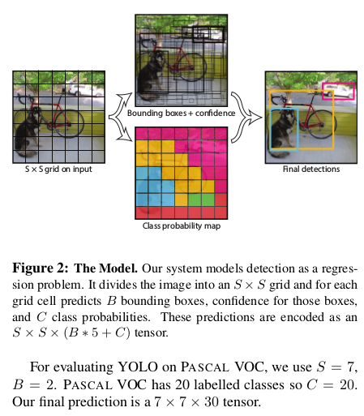
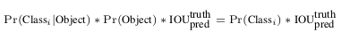
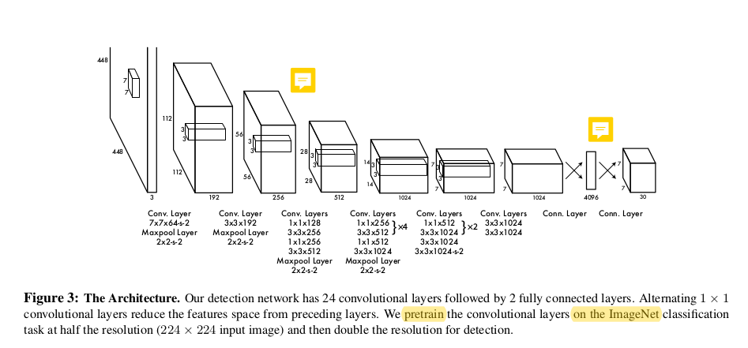
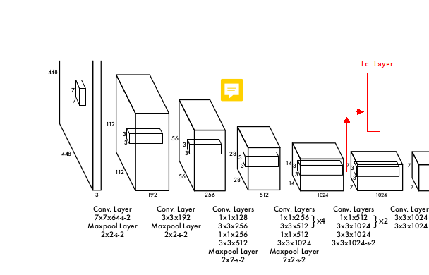
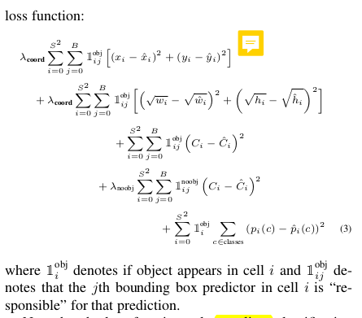
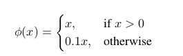

# YOLO V1 论文阅读总结和讨论

look for [papers for yolo1](https://github.com/leoluopy/paper_discussing/blob/master/yolo/yolo1/yolo_1.pdf)
contributer : [leoluopy](https://github.com/leoluopy)

+ 如果分享内容对你有帮助和启发，欢迎start / fork / follow 谢谢 ^_^ !
+ 由于知识有限，内容有错误，欢迎请提issue 谢谢 ^_^!
+ 如果对内容有疑问，欢迎提issue 谢谢 ^_^!
+ 如果你最近也有读深度学习相关paper ， 能认识更多志同道合朋友，还不加入分享 ？？   ^_^! 联系微信：leoluopy

# Overview

+ 首个OneStage网络（SSD也是）regression思路
+ 学习特征是泛化能力特别强特征(在艺术画上泛华能力仍然较强，对比同时期RCNN，RCNN在艺术画识别能力大幅下降)
+ 速度极快（多个子类型网络达到实时）
+ 摒弃滑窗或候选框，直接全局回归目标位置和分类

## 结构综述

图像首先分为SxS 个网格，在不同数据集和不同场景下可以设置不同S。对于每个网格预测B个Box和每个Box是否有对象。
另外对于每个网格仅预测一个类，而不是每个网格都预测类。

>这也是yolo1的弱点，每个网格只有一个类，如果多个类在同一个网格，那么就会出现漏检，特别是小目标。。

每一个BoundingBox回归的是（x，y，w，h）还有一个confidence：代表是否有对象的置信度。

> w 和 h 被回归到原图像的比例 【0,1】 之间 ， x，y 被回归为对应 网格的 offset 也在 【0,1】 之间

+ 因此他全连接层最后的tensor 为： （B×5 +C ）× S × S

## 预测置信度计算公式：

对应类概率 × 有无对象概率 × 预测box和真实box比值 = 最终预测置信度

## 网络设计

设计主思路：替换掉了inception module的思想，代替使用： 1x1降低特征空间 ； 3x3提取特征；两种卷积交替使用 再配合 MaxPooling 降维特征图。最后接两层全连接层，得到预测tensor

> NOTE： 后面 7x7x30 是在VOC这个数据集上的特例，作者使用了 7x7个网格，每个网格 2个Box 和 20个类 也就是（ 7x7x（2x5+20））= （7x7x30）.
在表示方法上全连接层可以被看做特殊的卷积层，上图把最后的全连接层画成了更容易理解的7x7x30 tensor形状。

> 另外作者还提供了tradeoff，更快的YOLO1网络：用9层卷积层替换24层卷积层

## 模型预训练

为了获取一个更强的特征提取器获取更强的泛化能力，作者使用了ImageNet对网络的前20层进行了分类器训练，训练过程从MaxPooling那层截断，
随后加入训练所需要的全连接层。在训练一周后得到了在ImageNet上，top5：88% 的结果。截取方法如上图所示。

## Loss 设计及训练方法

+ i,j 表示：第i个网格,其中第j个Box，梯度惩罚仅针对：有目标的网格，以及网格里面有正确Box的备选Box。 
+ batch size：64 ，momentum SGD： 0.9 ， decay： 0.0005  [ momentum 一般将参数设为0.5,0.9，或者0.99，分别表示最大速度2倍，10倍，100倍于SGD的算法]
+ 学习率： 为了避免过大的学习率使得模型陷入局部最优无法继续下降loss，首个epoch，缓慢提升学习率从10^-3 至 10^-2 ，10^-2 学习75个epoch，10^-3 学习30个epoch，10^-4 学习40epoch
+ drop out layer使用 0.5 ，这样避免了层与层之间的固定神经元连接的自动过拟合适应。
+ 图像增广：原图100%-120% 大小缩放和旋转，HSV空间到1.5比率的曝光和饱和度调整。
+ 由于梯度是整体反向传递，如果有对象的网格和无对象的网格采用同样的比重，那么这样的梯度会推动本来有对象的网格他的置信度向0移动。论文中成为 梯度 overpowering。
，为了解决这个问题，有对象的网格和无对象的网格在梯度下降时采用了不同比例参数。λ coord = 5 and λ noobj = 0.5
+ 在反向传递过程中，如果一个loss，对于比较大的对象是合适的惩罚，那么对于比较小的对象则是惩罚过度，比较大的和小的对象应该采用不同的惩罚
loss设计在长宽上加入求根运算，这种处理可以部分优化，但本质上仍然对于大小box的loss采用了一致的处理，在模型训练完成后的表现上，确实也出现yolo的检测卡特点：良好定位没问题，完美定位效果不太好。

## 其他知识点

+ 最后一层激活使用 linear ， 其他的激活使用 leaky rectified linear [激活函数公式见上图]
+ 对比FasterRcnn 这样网络，yolo 有更多的框不准问题，而FasterRcnn有更多的直接预测背景为目标。

