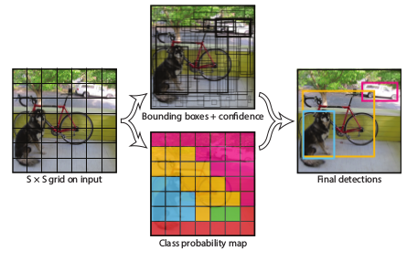
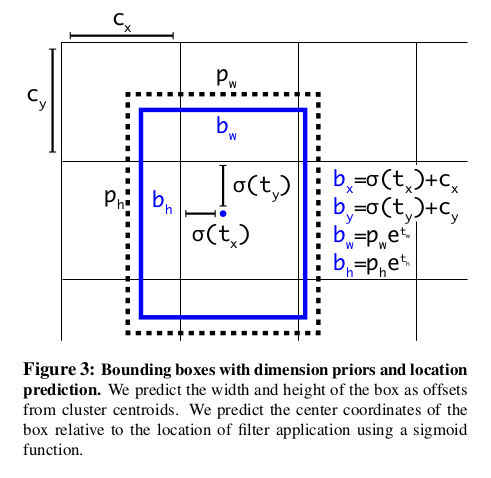
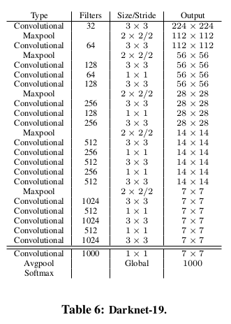
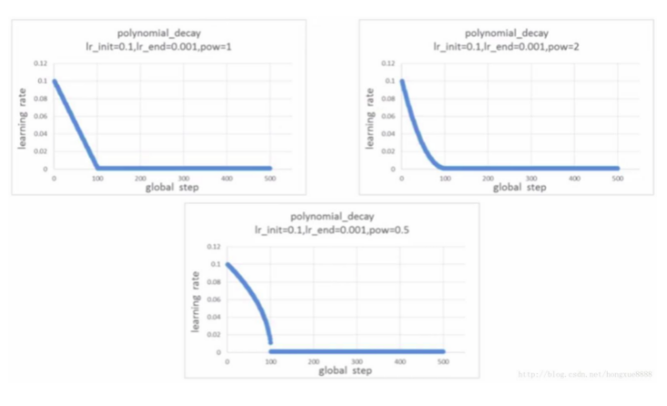
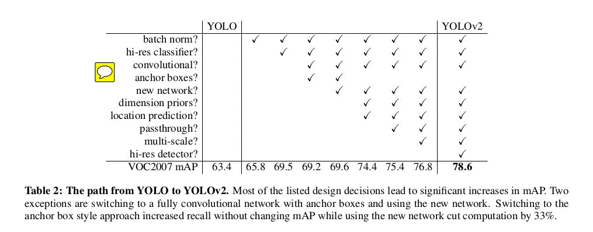
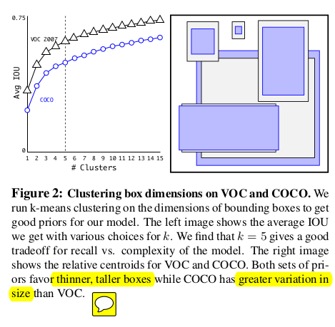
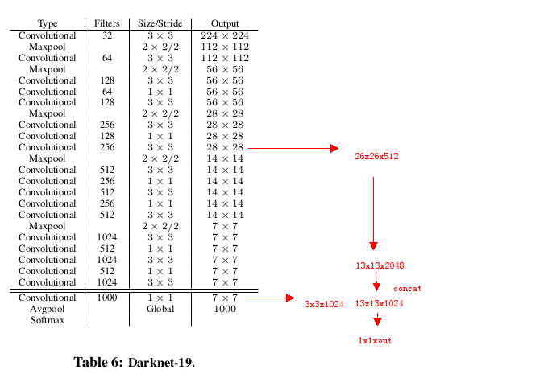
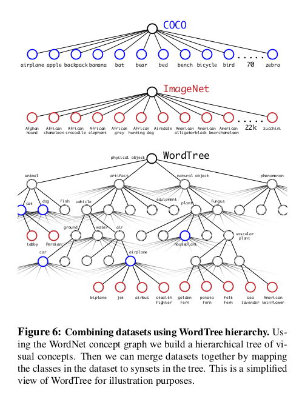
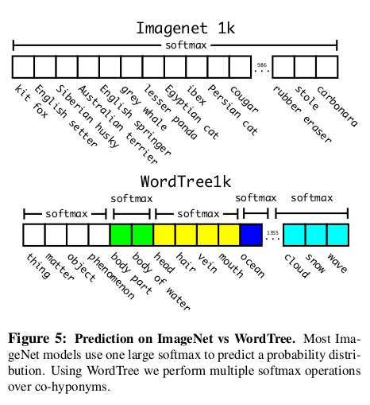

# YOLO V2 论文阅读总结和讨论

look for [papers for yolo2](https://github.com/leoluopy/paper_discussing/blob/master/yolo/yolo2/YOLO9000.pdf)
contributer : [leoluopy](https://github.com/leoluopy)

+ 如果分享内容对你有帮助和启发，欢迎start / fork / follow 谢谢 ^_^ !
+ 由于知识有限，内容有错误，欢迎请提issue 谢谢 ^_^!
+ 如果对内容有疑问，欢迎提issue 谢谢 ^_^!
+ 如果你最近也有读深度学习相关paper ， 能认识更多志同道合朋友，还不加入分享 ？？   ^_^! 联系微信：leoluopy

# Overview

+ 提出一种新型半监督的学习方法未标注boundingBox的分类图像来学习box检测任务
+ yolo1的升级版本，更快，更准。

## 结构综述

结构与[yolov1](../yolo1/yolo1_discussing.md)类似，但是提出了改进。网络支持多种分辨率，采用了全卷积网络，在不同数据集和不同场景下可以设置不同S。

|输入分辨率| 最终特征图 |
|:---:| :---: |
|416|13x13|
|448|14x14|
|480|15x15|
|512|16x16|
|608|19x19|

对于预测时的Anchor以及tensor如下图所示：

对比YOLOv1预测tensor： （B×5 +C ）× S × S 

每一个BoundingBox回归的是（x，y，w，h ，confidence）还有一个confidence：代表是否有对象的置信度。

YOLOv2 做出了扩展和改进 预测tensor：（B×5 × C ）× S × S 

B是Bounding Box 个数，也是YOLOV2 通过聚类得到的先验框个数。YOLOV2 对于每个Box都做了类别的预测。Cx 和Cy 是网格位置，Pw 和 Ph 是先验框参考长宽。

> 由于这种新机制的加入，每个cell会预测多个Box和多个类别，使得Yolov2对于小目标和单个网格多目标的检测效果得到不错提升。在顶级比赛中超越了当时的 FasterRCNN 系列和 SSD 系列。

## 模型及训练方法

+ 类似VGG模型，3x3卷积提取特征，在pool层降维后扩充特征提取深度至filter数2倍。在feature压缩上仍然使用1x1卷积，和yolo1一致。
+ 每个卷积层后加入BN，加速梯度下降。
+ 分类网络的训练：
    + 224 分辨率分类网络训练： 72.9% top-1 accuracy and 91.2% top-5 accuracy on ImageNet
    + 224 网络训练方法：
        * 160 epochs , momentum SGD优化方法
        * 
        * 起始学习率 0.1,多项式衰减 power：4 ，decay： 0.0005  ， momentum ： 0.9
    + 448 分辨率分类网络训练（全卷积网络直接finetune）： a top-1 accuracy of 76.5% and a top-5 accuracy of 93.3%
    + 图像增广方法：中心裁剪, 图像旋转, 色相调整, 饱和调整, 曝光调整

+ 基于分类网络作为backbone修改为检测网络：
    + 去除最后一层卷积网络，替换为3x3和1024个filter的卷积网络，随后再跟一层1x1卷积网络（filter数目就是最后需要输出的tensor）
+ 检测网络训练：
    + 训练超参：10^-3 前60epoch ，10^-4 第60-90 epoch,10^-5第90-160 epoch
    + 使用momentum优化方法 decay：0.0005

## 性能与速率提升

+ 对于每个卷积层后加入BN，给mAP贡献大约2个点。
+ 预训练分辨率提升（先224分辨率训练，随后448分辨率训练高分辨率分类器），给mAP贡献约4个点
+ AnchorBox使得预测框数量大量增加，对于mAP影响不大，但提高了召回
    + No Anchor：69.5 mAP with a recall of 81%
    + With Anchor：69.2 mAP with a recall of 88%

+ 
+ 先验框聚类选择K=5，保持了IOU，以及召回之间的平衡。

+ 细粒度特征  原始维度：13x13x1024 (详见上文检测网络修改) + passthrough layer： 26x26x512 -》 13x13x2048，类似于resNet的shortCut机制，给mAP贡献了大约1个点。
+ 多尺度训练 每10个epoch切换输入图像输入维度，图像维度： {320, 352, ..., 608}，由此，yolo网络在训练中得到了对多个尺度下输入图片的鲁棒性，并且在多个图像大小情况下，非常便捷得到速度与精度的折中。只需要修改输入图像大小即可，而网络没有发生变化。。
    > smallest option is 320 × 320 and the largest is 608 × 608
+ 分类器训练 见上文
+ 检测器训练 见上文

## 9000类别检测器的半监督训练

使用wordNet构建如上图所示，树状分类label网络。

ImageNet对1000个类直接使用softmax分类，因为类之间互斥。新建的wordTree，对同义类之间使用SoftMax。
> 同义类之间不存在绝对的互斥关系，特别是父子关系的类别，不存在互斥关系

对于没有detection标签的数据训练方式：对于分类loss的反向传播不变，随后找到对于该分类预测置信度最高的BoundingBox，使用这个BoundingBox的信息来做反向传播，并且假设和groundTruth至少有0.3的IOU
；使用这种方法在COCO这种本来就有detection label的类别上取得了不错的效果，但是比如想clothing ， sunglasses 这样在COCO上没有的数据，就没有取得比较好的效果。
