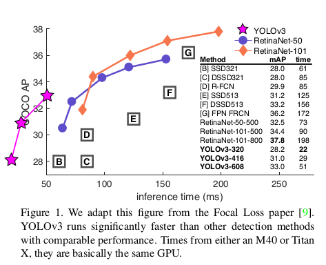
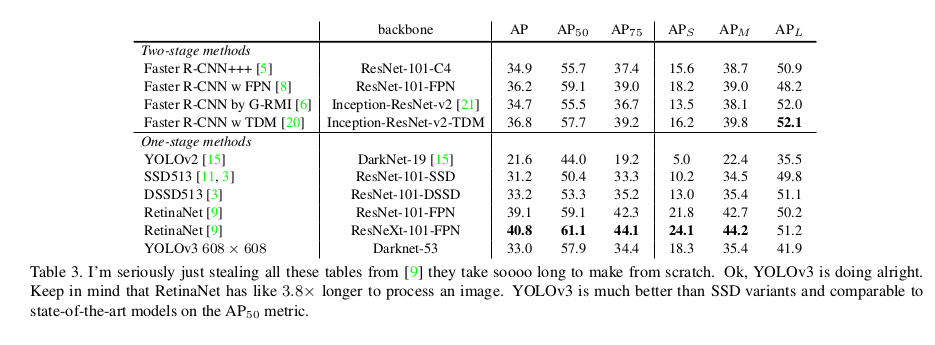
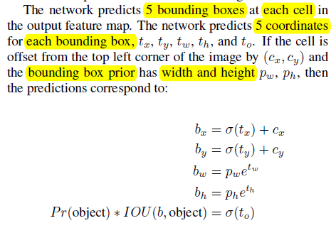
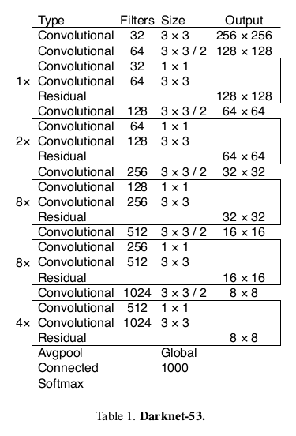
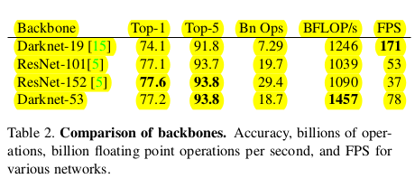
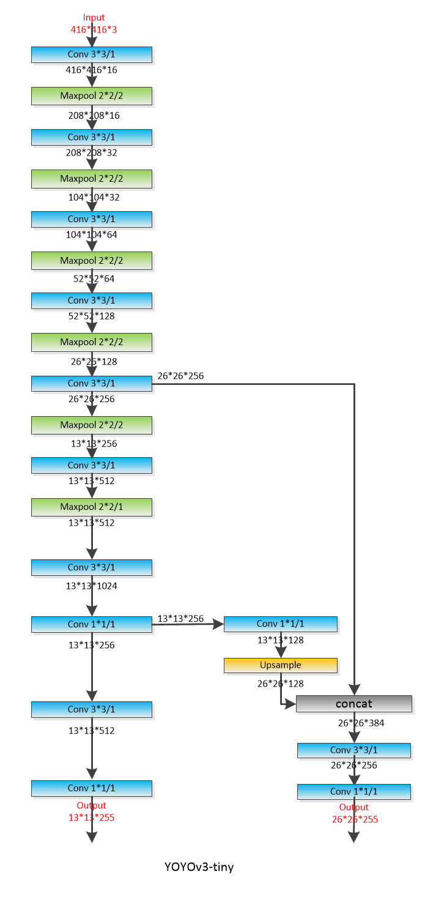

# YOLO V3 论文阅读总结和讨论

look for [papers for yolo3](https://github.com/leoluopy/paper_discussing/blob/master/yolo/yolo3/YOLOv3.pdf)
contributer : [leoluopy](https://github.com/leoluopy)

+ 如果分享内容对你有帮助和启发，欢迎start / fork / follow 谢谢 ^_^ !
+ 由于知识有限，内容有错误，欢迎请提issue 谢谢 ^_^!
+ 如果对内容有疑问，欢迎提issue 谢谢 ^_^!
+ 如果你最近也有读深度学习相关paper ， 能认识更多志同道合朋友，还不加入分享 ？？   ^_^! 联系微信：leoluopy

# Overview

+ 相对于yolov2，提出了darknet53，并增加更多passthrough layer ， 体积更大，但是更精准。
+ 在 320 × 320 分辨率下，YOLOv3 每帧 22 ms 并达到 28.2 mAP,和相同分辨率SSD一样精准，但是快3倍。

## 与YOLOV2 对比

+ 
+ 使用相同的 BoundingBox 预测tensor , 通过nms，每一个box仅预测一个object
+ 与v2 不同，增加了更多尺度，使用了 3个尺度进行预测 , 先验框使用 3个，簇使用9个簇，9个簇被均匀分割3份到3个不同的尺度预测tensor上。
    > On the COCO dataset the 9 clusters were:
(10 × 13), (16 × 30), (33 × 23), (30 × 61), (62 × 45), (59 ×
119), (116 × 90), (156 × 198), (373 × 326).
+ 
+ 特征提取器更新为：darknet53。 网络设计思路： 仍然采用3x3卷积提取特征，1x1卷积进行特征压缩 ； 另外在特征提取网络中也加入类似与resnet中的 shortCut机制。
+ 
+ Darknet-53 在相似准确率情况下对于 ResNet-101 快一半. Darknet-53 比 ResNet-152 快一倍 （速度测试在 TITAN X）
+ 在训练方法上与YOLOv2基本保持一致，没有对困难样本单独处理，仍然是多尺度训练，每层卷积后加BN，图像采用多种数据增强。

## 最后送上两幅结构图：

